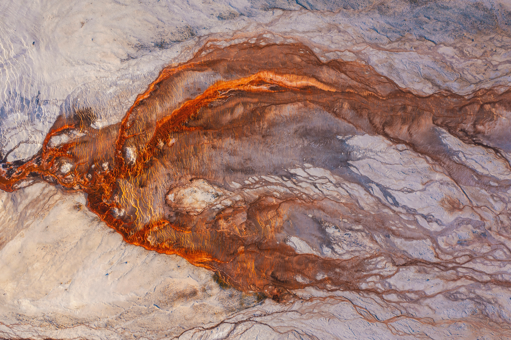

{width=100%}


This chapter will introduce a few applications of GIS tools and analyses in the Earth sciences. For more details, you may
refer to the introduction slides that will be provided as a supplementary material. We also provide a quick summary of how
 GIS is used in the domain of the geosciences and list data repositories that might be useful, grouped in categories at
 the global, european or national scale, on top of more targetted repositories.

# Geographic Information Systems (GIS)

According to the [United States Geological Survey (USGS)](https://www.usgs.gov/faqs/what-a-geographic-information-system-gis),
a Geographic Information System (GIS) is "a computer system that analyzes and displays geographically referenced
information. It uses data that is attached to a unique location".

We interact everyday with GIS: through our use of GPS for driving, finding places of interest on a map, even when we
write our postal address or schedule a trip. Understanding our planet and the processes that shape it requires us to use
GIS at various scales, from a global perspective (modelling of our climate, tectonic processes or the
distribution of species), to regional processes (volcanic eruptions, mountain ranges formation, or the evolution of drainage
basins systems), to even focused, local events such as landslides, forest fires or flooding events.

Moreover, understanding how our society works is also dependent on GIS, for critical aspects such as managing how our
cities are organized, understanding the amount of natural resources at our disposal, or to understand the population exposure
to risk. Using GIS helps to add a spatial dimension to the socio-economic challenges faced by humanity. Geospatial data
is in fact recognized by the United Nations as a useful source of information to [advance towards sustainable
development](https://www.un.org/geospatial/about/whatwedo).

# GIS Applications in Earth Sciences

## Remote Sensing

Remote sensing allows Earth scientists to collect data about the planet's surface without direct contact,
using satellite or airborne sensors. Key applications include land use and land cover mapping,
vegetation monitoring (e.g. NDVI), glacier retreat tracking, and urban expansion analysis.

## Natural Resources Exploration

GIS plays a central role in the exploration of mineral, energy, and water resources. By integrating
geological maps, geophysical surveys, and satellite imagery, scientists can identify prospective zones
for mineral deposits, map aquifer extents, or assess the potential of geothermal and hydrocarbon reservoirs.

## Natural Hazard Assessment and Risk Mapping

GIS enables the spatial analysis of hazard-prone areas, combining topographic, geological, and
climatic data to produce risk maps. Applications include landslide susceptibility mapping, flood
inundation modelling, volcanic hazard zonation, and seismic risk assessment (which are often combined with
population exposure data to evaluate societal vulnerability).

## Climate and Environmental Monitoring

Long-term geospatial datasets allow scientists to track environmental change over time. This includes
monitoring desertification, deforestation, coastal erosion, permafrost dynamics, and the impacts of
extreme weather events: all critical inputs for climate modelling and environmental policy.

## Geomorphology and Landscape Analysis

Digital Elevation Models (DEMs) and terrain analysis tools allow geomorphologists to characterize
landforms, derive drainage networks, compute slope and aspect, and study the evolution of landscapes
over geological timescales.

# Key Geospatial and Geological Data Sources

## Global Earth Science Geospatial Data

### Elevation & Topography
- **ETOPO** — [https://www.ncei.noaa.gov/products/etopo-global-relief-model](https://www.ncei.noaa.gov/products/etopo-global-relief-model)
  Global relief model combining bathymetry and topography at 15 arc-second resolution.
- **SRTM (Shuttle Radar Topography Mission)** — [https://www.earthdata.nasa.gov/data/instruments/srtm](https://www.earthdata.nasa.gov/data/instruments/srtm)
  Near-global digital elevation model at 30m resolution.
- **GEBCO** — [https://www.gebco.net](https://www.gebco.net)
  General Bathymetric Chart of the Oceans; global ocean depth and land elevation.

### Geological Maps
- **OneGeology** — [https://onegeology.org/](https://onegeology.org/)
  Global geological map data served via OGC web services, aggregated from national surveys.
- **CGMW (Commission for the Geological Map of the World)** — [https://www.ccgm.org](https://www.ccgm.org)
  Global and continental-scale geological maps.
- **GeoMapApp** — [https://www.geomapapp.org](https://www.geomapapp.org)
  Interactive application for exploring global geoscience datasets.

### Geophysics
- **EMAG2 / WDMAM** — [https://agupubs.onlinelibrary.wiley.com/doi/10.1029/2009gc002471](https://agupubs.onlinelibrary.wiley.com/doi/10.1029/2009gc002471)
  Global magnetic anomaly maps.
- **CRUST1.0** — [https://igppweb.ucsd.edu/~gabi/crust1.html](https://igppweb.ucsd.edu/~gabi/crust1.html)
  Global crustal thickness and structure model.
- **ISC (International Seismological Centre)** — [https://www.isc.ac.uk](https://www.isc.ac.uk)
  Global earthquake catalogue and seismicity data.

---

## European Resources

- **EMODNET (European Marine Observation and Data Network)** — [https://emodnet.ec.europa.eu](https://emodnet.ec.europa.eu)
  European marine geology, bathymetry, and seabed mapping.
- **EGDI (European Geological Data Infrastructure)** — [https://www.europe-geology.eu](https://www.europe-geology.eu)
  Pan-European geological data from national geological surveys, served via OGC services.
- **EuroGeoSurveys** — [https://www.eurogeosurveys.org](https://www.eurogeosurveys.org)
  Network of European geological surveys providing harmonised geospatial data.

---

## Swiss Resources

- **swisstopo** — [https://www.swisstopo.admin.ch/en/geodata-and-applications](https://www.swisstopo.admin.ch/en/geodata-and-applications)
  Swiss Federal Office of Topography; high-resolution DEMs, geological maps, and OGC web services.
- **Swiss Geophysical Commission (SwissGeol)** — [https://www.swissgeol.ch](https://www.swissgeol.ch)
  National geological data portal with borehole, stratigraphy, and subsurface data.
- **GeoMol** — [https://www.geomol.eu](https://www.geomol.eu)
  3D geological models of the Alpine Foreland basins, including Switzerland.

---

# Domain-specific repositories

## Palaeontology

- **Paleobiology Database (PBDB)** — [https://paleobiodb.org](https://paleobiodb.org)
  Global compilation of paleontological occurrence data.

---

## Lithology & Stratigraphy

- **Macrostrat** — [https://macrostrat.org](https://macrostrat.org)
  Global database of stratigraphic columns, rock units, and geological time.
- **OneStratigraphy** — [https://onestratigraphy.ddeworld.org/](https://onestratigraphy.ddeworld.org/)
  Global stratigraphic database linking rock units across regions.
- **Sedimentary, Geochemistry and Paleoenvironments Project (SGP)** — [https://sgp.stanford.edu/](https://sgp.stanford.edu/)
  Global compilation of sedimentary, geochemical, and paleoenvironmental data.

---

## Geochemistry

- **EarthChem** — [https://earthchem.org](https://earthchem.org)
  Portal for geochemical, geochronological, and petrological data.
- **PetDB (Petrological Database of the Ocean Floor)** — [https://earthchem.org/petdb](https://earthchem.org/petdb)
  Geochemical and petrological data for ocean floor rocks, a subcomponent of EarthChem.
- **GEOROC (Geochemistry of Rocks of the Oceans and Continents)** — [https://georoc.eu/georoc/](https://georoc.eu/georoc/)
  Global compilation of published analyses of igneous and metamorphic rocks.

---

## Mineralogy

- **Mindat** — [https://www.mindat.org](https://www.mindat.org)
  World's largest mineral database with locality and occurrence data.
- **Clay minerals global compilation** — [https://doi.org/10.1038/sdata.2017.103](https://doi.org/10.1038/sdata.2017.103)
  Global dataset of clay mineral occurrences in marine sediments.

---

## Geochronology

- **Zircon global compilation** — [https://doi.org/10.1038/s41597-023-02902-](https://doi.org/10.1038/s41597-023-02902-)
  Global compilation of detrital and igneous zircon U-Pb ages.
- **EarthTime** — [https://earthtime.org/](https://earthtime.org/)
  Initiative for improving the precision and accuracy of geochronological data.

---

## Paleogeography

- **PALEOMAP / PaleoDEMs** — [https://doi.org/10.5281/zenodo.5460860](https://doi.org/10.5281/zenodo.5460860)
  Palaeo-Digital Elevation Models for the Phanerozoic (Scotese & Wright, 2018).
- **PANALESIS** — [https://doi.org/10.5281/zenodo.15396265](https://doi.org/10.5281/zenodo.15396265)
  Global quantified palaeogeographic maps for the Phanerozoic (Franziskakis et al., 2025).
- **GPlates** — [https://www.gplates.org](https://www.gplates.org)
  Open-source software and associated data for plate tectonic reconstructions.
- **GPlates Portal** — [https://portal.gplates.org](https://portal.gplates.org)
  Web portal providing access to GPlates plate motion models and derived datasets.

# Python for GIS and Geology

Here are a few open and useful resources to dive in Python programming in the geosciences.

- Tenkanen, H., Heikinheimo, V., & Whipp, D. (2025). Geo-Python. University of Helsinki. Available online [https://geo-python-site.readthedocs.io/en/latest/](https://geo-python-site.readthedocs.io/en/latest/)
- Wu, Q. (2025). Introduction to GIS Programming: A Practical Python Guide to Open Source Geospatial Tools. Independently published. ISBN 979-8286979455. https://amazon.com/dp/B0FFW34LL3 Available oneline:[https://gispro.gishub.org/](https://gispro.gishub.org/)
- Gomez, A. (2026) Python for Geologists. Available Online: [https://github.com/kevinalexandr19/python_for_geologists?tab=readme-ov-file](https://github.com/kevinalexandr19/python_for_geologists?tab=readme-ov-file)
