This chapter will help you get started with Python and set your environment up. There are a few different options
available to run the scripts that are provided in this course.

We will dedicate time during the first day to make sure all students have their environment and code editors installed on
their machines. It is advised however to try and install one before the course starts.

Each exercise is available in numerous formats. First, you may access them on the [SPACE-GEOLOGY course website](https://unige-cgeom.github.io/SPACE-GEOLOGY),
under the tab `Course`. In this webpage, if you go to a specific exercise (or part) chapter, you can access it in pdf or
in a JupyterNotebook (.ipynb) format.

We recommend using the notebook format, as it allows you to read the explanations while running the code snippets. This
requires to have Python installed, alongside a code editor. Alternatively, you may decide to use Google Colab, an online
platform to run notebooks directly. Another option is to use QGIS, which has a dedicated plugin to run notebooks.

All information to set up your environment are provided below.

# Python
The SPACE-GEOLOGY course is based on Python, a widespread programming language used, amongst other things, to perform
data analysis. The Python ecosystem is made of libraries and packages designed to perform specific tasks. We will use
some of them that are focusing on data retrieval, analysis (spatial or non spatial) and visualization.

## Installing Python
Normally, most of the computers should have Python already installed, however we are going to use the Python 3.12 version,
which you can download from the [Python website](https://www.python.org/downloads/).

## Libraries

In this course, we will require the following libraries:

- [`xarray`](https://docs.xarray.dev/) A Python library for working with labeled multi-dimensional arrays, providing a Dataset structure that combines multiple variables sharing the same coordinate system.

- [`rioxarray`](https://corteva.github.io/rioxarray/) An extension of xarray that adds geospatial capabilities, enabling CRS-aware operations on raster datasets directly within the xarray framework.

- [`pandas`](https://pandas.pydata.org/) A Python library for data manipulation and analysis, providing a DataFrame structure that organizes tabular data with named columns and row indices.

- [`matplotlib`](https://matplotlib.org/) A comprehensive plotting library for creating static, animated, and interactive visualizations in Python.

- [`numpy`](https://numpy.org/) The fundamental package for efficient numerical computing in Python, providing fast arrays and mathematical operations.

- [`rasterio`](https://rasterio.readthedocs.io/) A Python library for reading, writing, and manipulating geospatial raster data using GDAL under the hood.

- [`requests`](https://requests.readthedocs.io/) A simple and elegant HTTP library for sending web requests and interacting with APIs.

- [`geopandas`](https://geopandas.org/) An extension of pandas for working with geospatial vector data, adding geometry support and spatial operations to DataFrames.

- [`os`](https://docs.python.org/3/library/os.html) A Python standard library module for interacting with the operating system, including file and directory management.

- [`xml.etree.ElementTree`](https://docs.python.org/3/library/xml.etree.elementtree.html) A Python standard library module for parsing and navigating XML documents as a tree structure, where each element's tag, attributes, and text are accessible as nodes.

# Code editors

Independent of your code editor, you should create a folder `SPACE-GEOLOGY-2026` on your machine, in a location of your choosing. This is where we will save our notebooks, store results and load input data from.

## Visual Studio (VS) Code

VS Code is a code editor developed by Microsoft. It is available for [Windows](https://code.visualstudio.com/docs/setup/windows),
[macOS](https://code.visualstudio.com/docs/setup/mac), or [Linux](https://code.visualstudio.com/docs/setup/linux).

You may follow the installation instructions associated to the operating system you are using, just make sure to have
the [Jupyter extension](https://marketplace.visualstudio.com/items?itemName=ms-toolsai.jupyter) also installed.

Open visual studio code, click on "Open folder"

Select your "SPACE-GEOLOGY_2026" folder and open it. If required, specify that you trust the project.

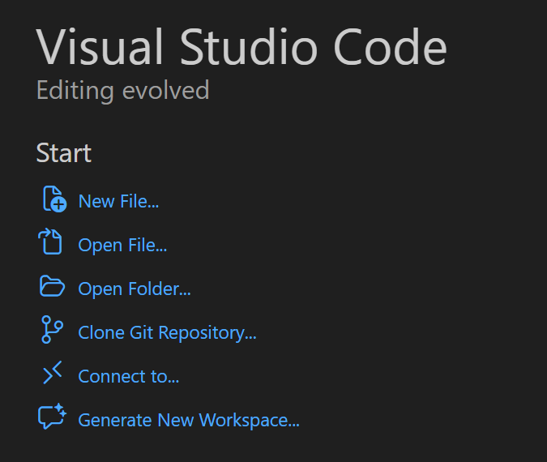{width=40%}

Go to the search bar on top of the window and click on "Show and Run Commands" (or just type Ctrl + Shift + P)

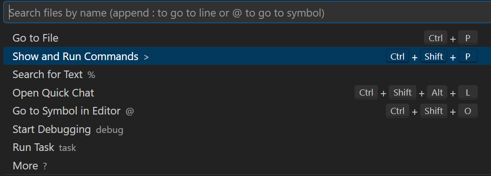{width=60%}

Search and click on "Python Create Environment" and select the "venv" option

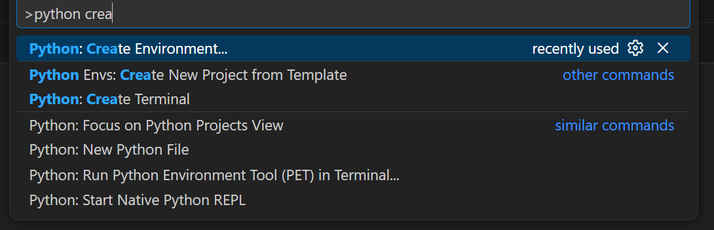{width=60%}

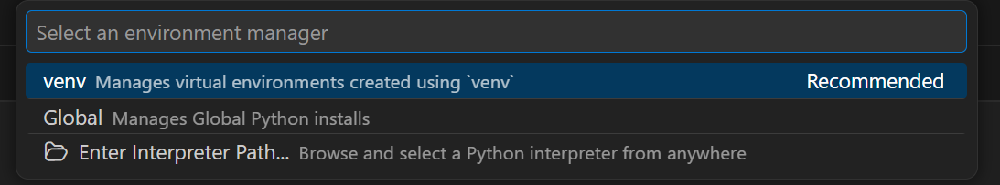{width=60%}

Select the correct version (we will use Python 3.12, so any of the Python 3.12 will work).

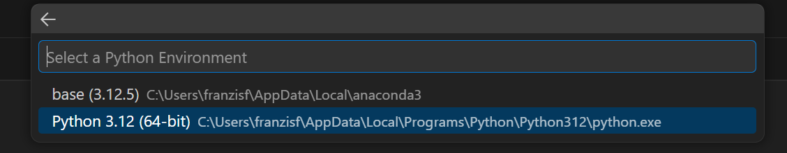{width=60%}

Keep `.venv` as the virtual environment folder name.

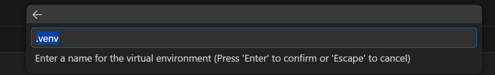{width=60%}

Add required packages to install by clicking on "Search PyPI packages". The full is in the section above. Notice that
some of the libraries are already included, so for now, let's just add xarray and pandas. We will install others later.

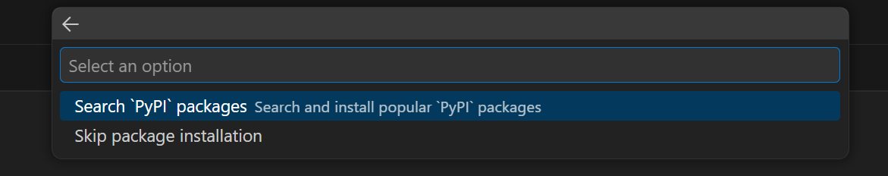{width=60%}

You should see a dialog box opening on the bottom left part of the screen saying that it is installing packages and
creating the virtual environment.

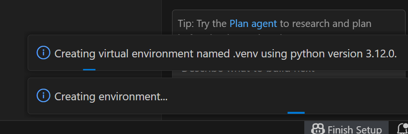{width=60%}

If successful, you should now see the virtual environment activated. Go to "View" and select "Terminal". A window should
open on the bottom of the screen with the path to your SPACE-GEOLOGY-2026 folder, with a green `(.venv)` before it.
This means that your environment is correctly installed and running.

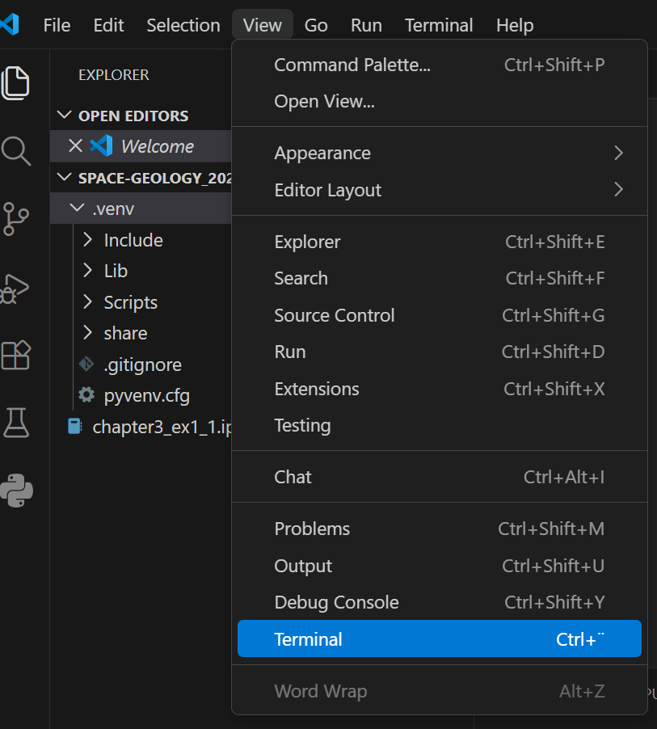{width=60%}

Now, let's go to the terminal. We previously only installed xarray and pandas. We need to install more libraries
before starting to work. We will use the package installer for Python to manually install them. The command you need to
type in your terminal is

`pip install <package>`

so for instance, to install rioxarray, just type

 `pip install rioxarray`

You will see some code running to install `rioxarary` and other dependencies. Repeat this for other packages until all
required ones are installed. If you try and install a package that is already installed, no problem, you will simply see
a message stating that the requirement is already satisfied.

**Note:** there are some libraries that are part of the Python standard libraries like os or xml.etree.ElementTree, no need
to install these.

**You are now ready to run your code !**

## PyCharm

PyCharm is an Integrated Development Environment (IDE) for Python that is also available for
[Windows](https://www.jetbrains.com/pycharm/download/?section=windows),
[macOS](https://www.jetbrains.com/pycharm/download/?section=mac), or [Linux](https://www.jetbrains.com/pycharm/download/?section=linux).

With its latest version, PyCharm now supports the integration of Jupyter Notebooks.

Open PyCharm, click on "Open"

Select your "SPACE-GEOLOGY_2026" folder and open it. If required, specify that you trust the project.

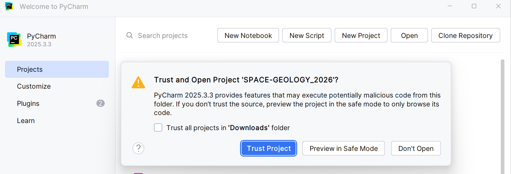{width=60%}

Once opened, go the main menu (top left corner horizontal lines icon), and select "Settings".

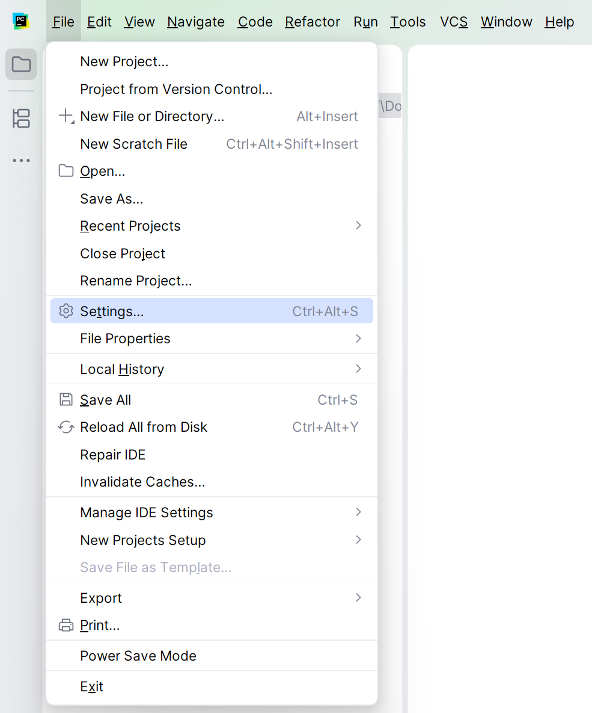{width=60%}

A new window should appear. If not selected already, click on "Python/Interpreter" and click on the "Add interpreter"
button. Choose the option "Add local interpreter"

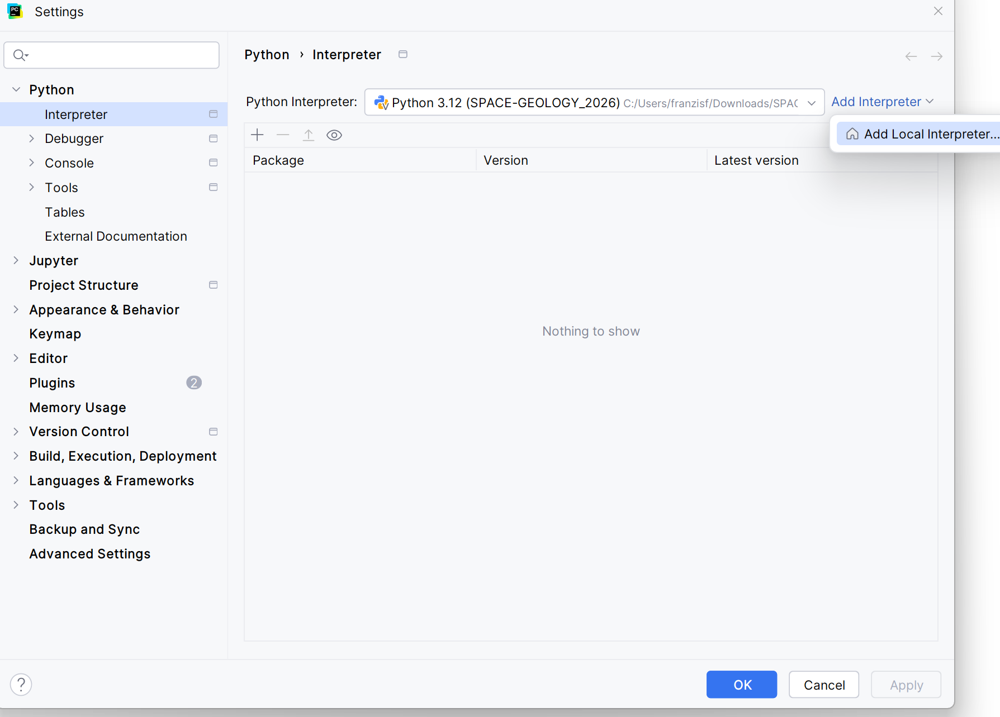{width=60%}

Another window should open where you can configure the virtual environment. Select "Generate new", choose a 3.12 version
of Python and keep the path in your "SPACE-GEOLOGY-2026" folder. CLick "OK" and wait for the venv to be installed.

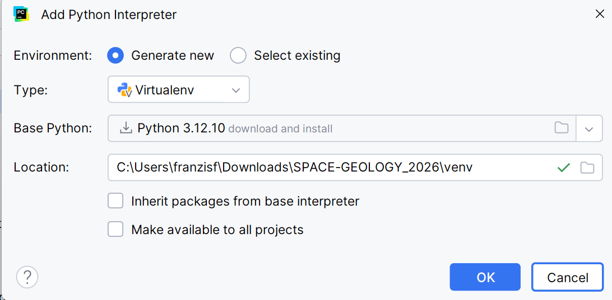{width=60%}

If successful, you should now see the virtual environment activated. Go to the bottom right corner and click on the
terminal icon {width=5%}. You can also open the terminal by using `Alt + F12`. A
window should open on the bottom of the screen with the path to your SPACE-GEOLOGY-2026 folder, and a `(venv)` before it.
This means that your environment is correctly installed and running.

Now, another step is to install the required libraries before starting to work. We will use the package installer for
Python to manually install them. The command you need to type in your terminal is:

`pip install <package>`

so for instance, to install rioxarray, just type

 `pip install rioxarray`

You will see some code running to install `rioxarary` and other dependencies. Repeat this for other packages until all
required ones are installed. If you try and install a package that is already installed, no problem, you will simply see
a message stating that the requirement is already satisfied.

**Note:** there are some libraries that are part of the Python standard libraries like os or xml.etree.ElementTree, no need
to install these.

**You are now ready to run your code !**

## Google Colab

Google Colab is an online service for running Jupyter Notebooks without the need for local code editor installation. It
can simply be accessed from [your browser](https://colab.research.google.com/) and already contains most of the required
libraries.

To use Colab, you will require a Google account. Go to the website and login. Once logged in, you may simply select the
"Upload" option and click on "Browse" to load the notebook from your computer.

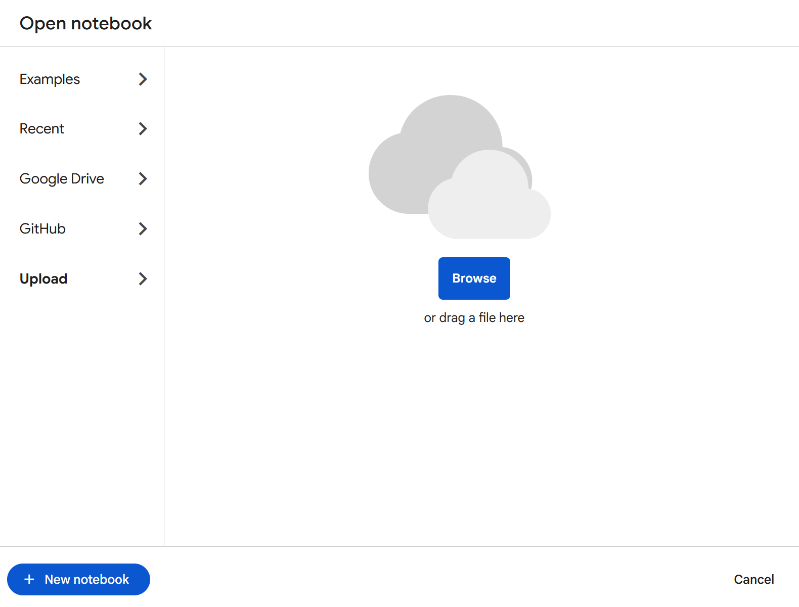{width=60%}

**You are not ready to run your code !**

## QGIS Notebook

QGIS Notebook is a plugin that can be [installed in QGIS](https://plugins.qgis.org/plugins/qgis_notebook/) to run and
write notebooks. It uses the Python environment that comes with QGIS.

To install the plugin, open QGIS, and go to the top options and select "Plugins", then click on "Manage and Install Plugins".

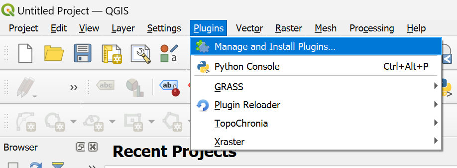{width=60%}

A new window should open. Click on "All" and search "Notebook". You should see it appear. CLick on "Install Plugin"

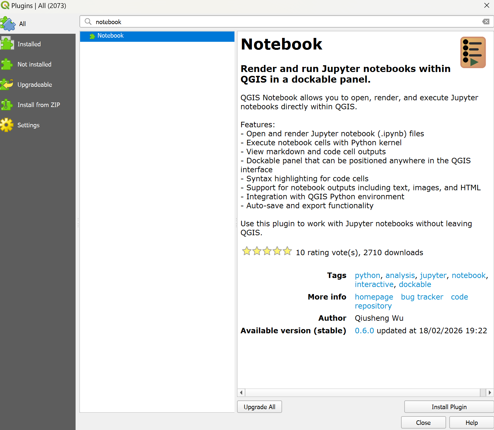{width=60%}

If successfully installed, you should see a message pop up in the top of this window, and some icons appearing in your
toolbar : 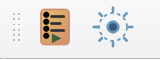{width=10%}. Clicking on the first icon will open the notebook user interface.

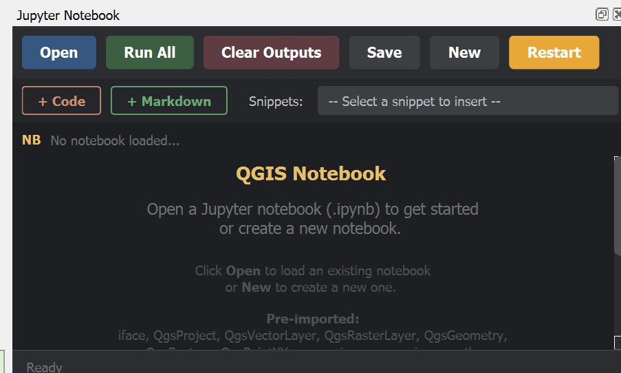{width=60%}

The notebooks from the exercise can be opened by just clicking on "Open" and load your notebooks.

**You are not ready to run your code !**

