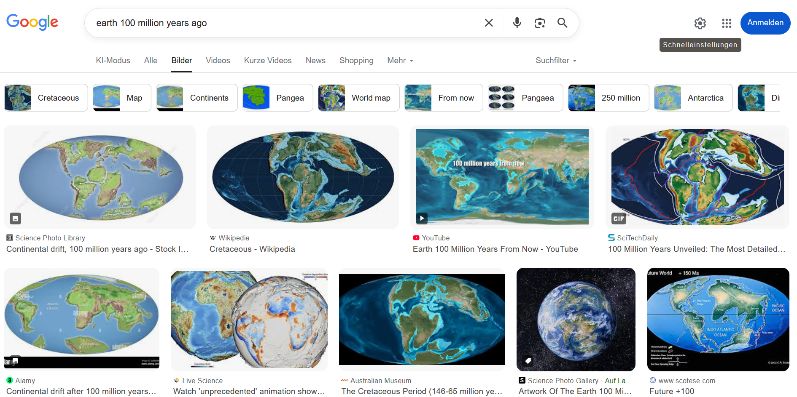
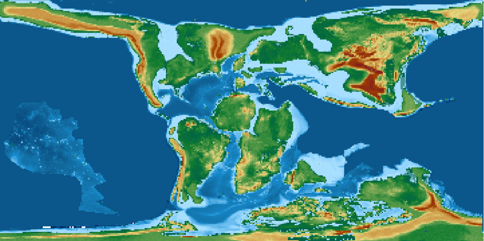
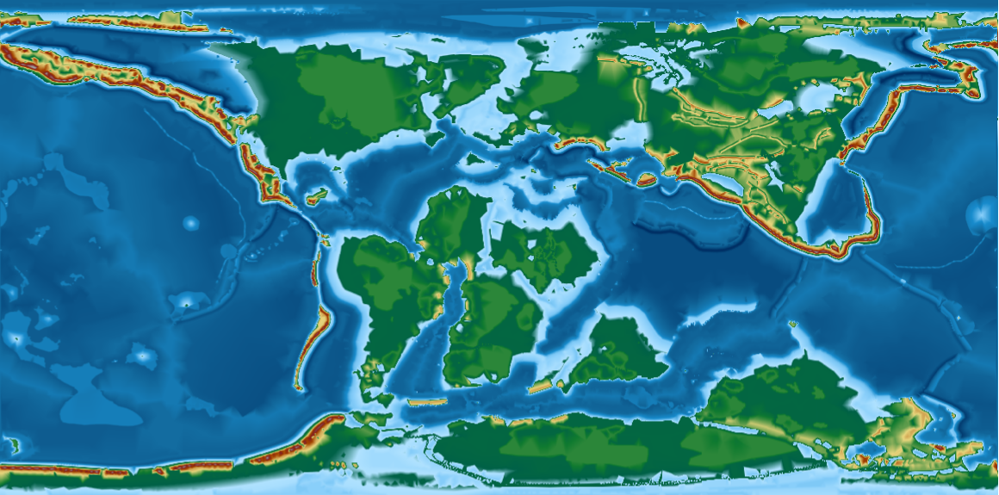

# Reconstructing Earth’s Past – From a Snapshot to Deep Time
::: {.callout-note collapse="true"}
# This exercise in brief

### Big Question
*How did Earth look 100 million years ago, and how has its geography changed over hundreds of millions of years?*

### What You Will Do

In this module, you will:

1.	Start simple: Explore a single paleogeographic map and visualize Earth at 100 Ma.

2.	Compare worlds: Compute and interpret differences in land and ocean distribution between two time slices.

3.	Go deep time: Extend your analysis to the entire Phanerozoic (last 540 million years) and identify major trends.

### Why This Matters

Earth’s geography controls climate, ocean circulation, and biodiversity. By reconstructing these changes, you’ll learn how scientists use data and coding to answer fundamental questions about our planet’s history.

### Your Tasks

1. **Find the data:** Search on the web for maps of the Earth's past.
2. **Load and inspect:** Read raster data in Python, check metadata, and understand its structure.
3. **Compute basic stats:**

    3.1. Land vs. ocean fraction for a chosen time slice.

    3.2. Differences between two slices.

    3.3. A time series of land fraction across the Phanerozoic.

4. **Visualize:**

   4.1 Global maps using matplotlib and cartopy.

    4.2. A trend plot showing how land/ocean distribution evolved.

### Skills You Will Gain

1. Working with GeoTIFFs in Python (rasterio, numpy).
2. Performing basic geospatial analysis (masking, counting, area-aware calculations).
3. Creating global maps and time-series plots.
4. Automating workflows for multi-step analysis.


### Points for Discussion

*What assumptions did you make when defining land vs. ocean?*

*How does using pixel counts vs. area-aware calculations affect your results?*

*What patterns do you see in land fraction across the Phanerozoic? Any surprises?*

:::

# Step-by-step instructions

**1. Find the data**

You want to learn what the Earth looked like 100 millions of years ago. Where do you look for such kind of data ?

Using a search engine, results will typically yield something like:



&rarr; Have a look at the various results, how many are actual maps (e.g. with formats that are compatible with geographic
information systems (GIS) software ?

Do some maps look similar ? Do they share a common course ? Or, on the contrary, do they look drastically different ?

In our exercise, we are particularly interested in having maps of the entire Earth, and we we will see further, not only
one (unique) map but a series of maps showing us the evolution of the Earth for hundreds of millions of years.

Among the most well known sources of data, you have a dataset created by C. Scotese & N. Wright

Scotese, C. R., & Wright, N. M. (2018). PALEOMAP Paleodigital Elevation Models (PaleoDEMS) for the Phanerozoic [Data set]. Zenodo. https://doi.org/10.5281/zenodo.5460860

This dataset contains 88 maps showing the palaeo Digital Elevation Model (palaeo-DEM) over the Phanerozoic (from 541 Ma to present-day).

For 100Ma, the map would look like (with map resolution at 1x1°):




&rarr; Try and display the same map in your Desktop GIS. <br>

It is easier to get the maps at 1x1° resolution from the EarthByte webpage listed in the original record.

&rarr; Explore the map.
Particularly, pay attention to the rendering of the topography. What do you observe on continents ? What about oceans ?

We found our first example very useful to get a sense of how the Earth looked like 100 millions of years ago. However,
we noticed some limitations. We also want to benefit from the experience we have at the University of Geneva in this domain.

We are going to use the PANALESIS plate tectonic model and its derived palaeogeographic maps, that were developed at UNIGE.

The data is available at:

Franziskakis, F., Vérard, C., Castelltort, S., & Giuliani, G. (2025). Global Quantified Palaeogeographic Maps and Associated Sea-level Variations for the Phanerozoic using the PANALESIS Model [Data set]. Zenodo. https://doi.org/10.5281/zenodo.15396265

&rarr; Load the 100Ma map and compare it to the Scotese & Wright map. The PANALESIS map should look something like:




**2. Load and inspect**

In the two examples above, we manually downloaded maps from an open data archive, and opened a single one with a dekstop
GIS software. This may be useful to have a first look at some data, yet, if we want to get a deeper understanding of what
our data can reveal, we need a simpler (more direct) way to access and most importantly, to analyze our data.

Fortunately for us, there are some easy ways to serve geospatial data directly to users via the web, to avoid downloading
data on your local machine each time you need it. To do this, we will have a look at the Open Geospatial Consortium (OGC)
web services, that include the Web Map Servives (WMS), or the Web Coverage Services (WCS). These two types of services
are used on raster data. For vector data, the dedicated service is the Web Feature Services (WFS).

We will use the OGC web services to get data that is stored in a server dedicated to serve geospatial data (GeoServer).
The common way to get data is through a request using an URL that contains all elements required by the web services. In
our case, we will need to specify some information on the following elements:

+ The base URL where the server is hosted
+ The name of the data store inside the server that contains the data
+ The name of the layer we want to access
+ The coordinate reference system (CRS) of the layer
+ The desired bounding box (spatial extent) of the layer
+ The resolution of the map
+ The time step that we want to access (optionnal)
+ The output format we want (e.g. GeoTIFF).

We are going to retrieve the data from the PANALESIS server, which is hosted at the following URL:
https://geoserver.panalesis.org/geoserver/web/?2

If you open this link in your browser, and click on "Layer Preview", you will see all available layers. We will try and
explore (almost) all of them in this course. For now, our goal is still to access the palaeogeographic map at 100Ma.

Typically, in our example, a correct URL for a web coverage service (WCS), which will return a full map will look like:

```{python}
base_url = "https://geoserver.panalesis.org/geoserver/"
workspace = "panalesis_atlas_epsg_4326"
service_type = "WCS"
service_version = "1.0.0"
request_type = "GetCoverage"
layer_name = "palaeogeography_4326"
crs = "EPSG:4326"
bbox = "-180,-90,180,90"
resx = "0.1"
resy = "0.1"
time = "2100-01-01T00:00:00.000Z"
format = "GEOTIFF"

wcs_url = (rf"{base_url}{workspace}/{service_type.lower()}?service={service_type}&version={service_version}&"
                       rf"request={request_type}&"
                       fr"coverage={workspace}:{layer_name}&"
                       fr"crs={crs}&"
                       rf"bbox={bbox}&"
                       rf"resx={resx}&"
                       rf"resy={resy}&"
                       rf"time={time}&"
                       rf"format={format}")
print(wcs_url)

```

&rarr; Test what happens when you copy and paste this link in your browser.

Now we would like to directly retrieve the data, we can simply associate it to a temporary layer and
visualize it.


```{python}
import requests
import matplotlib.pyplot as plt
from rasterio.io import MemoryFile

data = requests.get(wcs_url).content
with MemoryFile(data) as memfile:
    with memfile.open() as dataset:
        plt.imshow(dataset.read(1), cmap='terrain')
        plt.colorbar()
        plt.show()
```

You can now recognize the same kind of map as shown above, with two major differences. What are they ?

We are going to resolve this by adding a correct color ramp and setting the axes to reflect longitude and latitude
instead of pixel index.

```{python}
import matplotlib.colors as mcolors
import numpy as np

colormap_entries = [
    (9000, "#ffffff", "9000"),
    (7000, "#cecece", "7000"),
    (5000, "#a1a1a1", "5000"),
    (3000, "#821e1e", "3000"),
    (2000, "#a34400", "2000"),
    (1000, "#e8d67d", "1000"),
    (200, "#107b30", "200"),
    (0, "#006147", "0"),
    (-100, "#b0e2ff", "-100"),
    (-500, "#87cefa", "-500"),
    (-2000, "#188ccd", "-2000"),
    (-4000, "#136ca0", "-4000"),
    (-7000, "#003266", "-7000"),
    (-9000, "#001e64", "-9000"),
    (-11000, "#000050", "-11000"),
]

colormap_entries_sorted = sorted(colormap_entries, key=lambda x: x[0])
elevations = [e[0] for e in colormap_entries_sorted]
colors = [e[1] for e in colormap_entries_sorted]

vmin, vmax = elevations[0], elevations[-1]
norm_values = [(e - vmin) / (vmax - vmin) for e in elevations]
cmap = mcolors.LinearSegmentedColormap.from_list("palaeogeography", list(zip(norm_values, colors)))
norm = mcolors.Normalize(vmin=vmin, vmax=vmax)

data = requests.get(wcs_url).content
with MemoryFile(data) as memfile:
    with memfile.open() as dataset:
        raster = dataset.read(1).astype(float)

        nodata = dataset.nodata
        if nodata is not None:
            raster[raster == nodata] = np.nan

        bounds = dataset.bounds
        extent = [bounds.left, bounds.right, bounds.bottom, bounds.top]

        fig, ax = plt.subplots()
        img = ax.imshow(raster, cmap=cmap, norm=norm, extent=extent, origin="upper")
        cbar = plt.colorbar(img, ax=ax)
        cbar.set_label("Elevation (m)")
        ax.set_xlabel("Longitude (°)")
        ax.set_ylabel("Latitude (°)")
        plt.show()
```

We now have the same result as the one above, and all elements making it a comprehensive map are present (realistic colors,
legend, axes labels). However, we can go further and read some basic metadata from the WCS request itself.


```{python}
data = requests.get(wcs_url).content
with MemoryFile(data) as memfile:
    with memfile.open() as dataset:
        print(dataset.meta)
        print(dataset.bounds)
        print(dataset.crs)
        print(dataset.transform)
```

These few lines will give you useful information to understand the nature of the data you are dealing with. the result
will inform you about the full list of attributes, including the data format, type, how no-data value pixels
 are represented, the raster dimensions, the coordinate reference system, and the "transform" which is the affine
 transformation matrix to match the pixel position (x and y) in the original file with their corresponding longitude and
 latitude.

&rarr; Before going to the next part, write a quick summary about the data we just discuss:

+ Where does it come from ?
+ What does it represent ?
+ From a GIS perspective, what are the key properties of the dataset ?
+ Finally, from a geological point of view, what do you observe in the map, compared to our present-day Earth ?

**3. Compute basic statistics**

As you might have observed, we can immediately spot differences between the world at 100Ma compared to the world we know
today. We however need a way to quantify these differences objectively. Fortunately for us, this ca be performed quite
easily with a few functions that we will explore now.

Before diving into the analysis of our map, we however need to recognize a limit with its dimensions. As noted before,
the current CRS are the "traditional" EPSG:4326 (WGS 1984), with units expressed in decimal degrees. This is not useful
if we want to compute areas. For this reason, we will switch to the same map that are represented using an equal area
projection. In our case, we will use an equal area projection.

The new WCS url is defined as follows:

```{python}
base_url = "https://geoserver.panalesis.org/geoserver/"
workspace = "panalesis_atlas"
service_type = "WCS"
service_version = "1.0.0"
request_type = "GetCoverage"
layer_name = "palaeogeography"
crs = "EPSG:54034"
bbox = "-20037508.34,-6363885.33,20037508.34,6363885.33"
resx = "10000"
resy = "10000"
time = "2100-01-01T00:00:00.000Z"
format = "GEOTIFF"

wcs_url = (rf"{base_url}{workspace}/{service_type.lower()}?service={service_type}&version={service_version}&"
                       rf"request={request_type}&"
                       fr"coverage={workspace}:{layer_name}&"
                       fr"crs={crs}&"
                       rf"bbox={bbox}&"
                       rf"resx={resx}&"
                       rf"resy={resy}&"
                       rf"time={time}&"
                       rf"format={format}")
data = requests.get(wcs_url).content
with MemoryFile(data) as memfile:
    with memfile.open() as dataset:
        raster = dataset.read(1).astype(float)

        nodata = dataset.nodata
        if nodata is not None:
            raster[raster == nodata] = np.nan

        bounds = dataset.bounds
        extent = [bounds.left, bounds.right, bounds.bottom, bounds.top]

        fig, ax = plt.subplots()
        img = ax.imshow(raster, cmap=cmap, norm=norm, extent=extent, origin="upper")
        cbar = plt.colorbar(img, ax=ax)
        cbar.set_label("Elevation (m)")
        ax.set_xlabel("Longitude (m)")
        ax.set_ylabel("Latitude (m)")
        plt.show()
```

Notice how the bounds value changed: everything is not expressed in meters, which are much better units than decimal
degrees when calculating areas. In our example, we will have a quick look at the land and oceanic area, which are simply
defined as the count of pixels respectively above, and below or equal to 0m of elevation, multiplied by the area of
pixels.

This can be implemented using a very simple function:

```{python}


def get_land_ocean_area(data, transform, extent, plot=False):
    pixel_area = abs(transform[0] * transform[4])

    # Masks
    land_mask = data >= 0
    ocean_mask = data < 0

    if plot:
        fig, ax = plt.subplots()
        img = ax.imshow(
            land_mask,
            cmap="Greys",
            interpolation="none",
            extent=extent,
            origin="upper"
        )

        # no colorbar for a mask
        ax.set_xlabel("Longitude (m)")
        ax.set_ylabel("Latitude (m)")
        plt.tight_layout()
        plt.show()

    land_area = np.sum(land_mask) * pixel_area
    ocean_area = np.sum(ocean_mask) * pixel_area

    return land_area, ocean_area


```

This function will take the input raster data and simply look for pixels above sea-level to define them as land, and do
the same with pixels at or below sea-level and define in the ocean mask. Then, it will calculate the respective areas by
multiplying them by the pixel area.

You can call this function on the raster we previously loaded:

```{python}

land_area, ocean_area = get_land_ocean_area(raster,dataset.transform,extent, plot=True)
print("Land area =", land_area, "m²")
print("Ocean area =", ocean_area, "m²")

```
&rarr; What do these number mean ? Are they realistic ?

We want to compare this value to the present-day world. Now, we know how to do it, we simply need to change the data
source and set it to the present-day reconstruction. You might have observed how the time dimension was defined in the
previous requests.
For instance, the 100Ma map was obtained using `time = "2100-01-01T00:00:00.000Z"`. This is a trick
to follow the ISO 8601 standard. We simply add the geological age (in millions of years) to the year 2000. For the 100Ma
map, the code is therefore 2**100**-01-01T00:00:00.000Z.

To obtain the map at present-day, we can create a new WCS request with an updated `time` value and calculate the same
statistics as we did for 100Ma:

```{python}

time = "2000-01-01T00:00:00.000Z"

wcs_url = (rf"{base_url}{workspace}/{service_type.lower()}?service={service_type}&version={service_version}&"
                       rf"request={request_type}&"
                       fr"coverage={workspace}:{layer_name}&"
                       fr"crs={crs}&"
                       rf"bbox={bbox}&"
                       rf"resx={resx}&"
                       rf"resy={resy}&"
                       rf"time={time}&"
                       rf"format={format}")

data = requests.get(wcs_url).content
with MemoryFile(data) as memfile:
    with memfile.open() as dataset:
        raster = dataset.read(1).astype(float)

land_area, ocean_area = get_land_ocean_area(raster,dataset.transform,extent, plot=True)
print("Land area =", land_area, "m²")
print("Ocean area =", ocean_area, "m²")

```

&rarr; Are these number realistic ? Search for the actual land and ocean areas and compare them with your results.

Finally, we are going to extend this analysis to all our available maps. For this, we will simply create a loop that
iterates through all time steps and extract the values for land and ocean areas. First, we can define a function that
lists all available reconstructions. We can do this using the The `xml.etree.ElementTree` module, a Python standard
library tool for parsing and navigating XML documents as a tree structure, where each element (tag, attributes, text) is
accessible as a node.


```{python}
from xml.etree import ElementTree as ET

def get_available_times(base_url, workspace, service_type, service_version, layer_name):
    describe_url = (
        f"{base_url}{workspace}/{service_type.lower()}"
        f"?service={service_type}&version={service_version}"
        f"&request=DescribeCoverage&coverage={workspace}:{layer_name}"
    )

    response = requests.get(describe_url)
    root = ET.fromstring(response.content)

    times = sorted(set(el.text for el in root.iter() if el.tag.endswith('timePosition') and el.text))
    return sorted(times)

```

The response from the request we send to the server comes back as XML, a nested syntax with tags that is very useful for machines
to read text, but not so much for us. In our case, we sent a `DescribeCoverage` for a given layer, which yields back
information about spatial and temporal coverage of the layer. We are only interested in the `time` property so this is
why we filter out only values inserted inside the `timePosition` tag.

If we call the function:

```{python}

times = get_available_times(base_url, workspace, service_type, service_version, layer_name)
print(times)

```
You can see that we have the times displayed here in the same format as we have used before (tweaked time values, not
the geological age in millions of years). Now that we have a list with all available ages, it is possible to iterate
through this list and analyze the map associated with every time step.

In the code snippet below, we create a `for` loop that will use each value in the times list, extract the geological
age value, create a WCS request and get the data, calculate its land and ocean area, and store them in a dictionary.

```{python}
results = {}
for time in times:
    geological_age = int(time[:4]) - 2000
    wcs_url = (rf"{base_url}{workspace}/{service_type.lower()}?service={service_type}&version={service_version}&"
               rf"request={request_type}&"
               fr"coverage={workspace}:{layer_name}&"
               fr"crs={crs}&"
               rf"bbox={bbox}&"
               rf"resx={resx}&"
               rf"resy={resy}&"
               rf"time={time}&"
               rf"format={format}")

    data = requests.get(wcs_url).content
    with MemoryFile(data) as memfile:
        with memfile.open() as dataset:
            raster = dataset.read(1).astype(float)

            nodata = dataset.nodata
            if nodata is not None:
                raster[raster == nodata] = np.nan

            bounds = dataset.bounds
            extent = [bounds.left, bounds.right, bounds.bottom, bounds.top]
    land_area, ocean_area = get_land_ocean_area(raster, dataset.transform, False)
    results[geological_age] = {'land_area': float(land_area), 'ocean_area': float(ocean_area)}
    del raster, data

print(results)

```

Finally, we can plot the evolution of these two variables through time. In the example below, we create two separate
plots, one for land, another for oceans with a reversed x-axis value (0Ma = present-day is on the right-side).


```{python}
ages = list(results.keys())
land_areas = [results[age]['land_area'] for age in ages]
ocean_areas = [results[age]['ocean_area'] for age in ages]

fig, (ax1, ax2) = plt.subplots(1, 2, figsize=(8, 3.5))

ax1.plot(ages, land_areas, color='darkgreen', marker='o', markersize=4)
ax1.set_xlabel('Age (Ma)')
ax1.set_ylabel('Land area (m²)')
ax1.invert_xaxis()
ax1.set_box_aspect(1)

ax2.plot(ages, ocean_areas, color='darkblue', marker='o', markersize=4)
ax2.set_xlabel('Age (Ma)')
ax2.set_ylabel('Ocean area (m²)')
ax2.invert_xaxis()
ax2.set_box_aspect(1)

plt.tight_layout()
plt.show()

```
&rarr; What do you observe ?

&rarr; You have seen what we can do with simple masks representing land and ocean. Do you have any ideas about other
statistics we could easily plot ? Try it !


::: {.callout-tip collapse="true"}
# Links to useful libraries and tools


### Geospatial tools

- [`Web Map Service (WMS)`](https://www.ogc.org/standards/wms/) — An OGC standard protocol for requesting georeferenced map images (e.g., PNG, JPEG) from remote servers.

- [`Web Coverage Service (WCS)`](https://www.ogc.org/standards/wcs/) — An OGC standard for accessing raw raster datasets (“coverages”) such as elevation models, climate grids, and satellite imagery, preserving full numeric values.


### Python libraries

- [`matplotlib`](https://matplotlib.org/) A comprehensive plotting library for creating static, animated, and interactive visualizations in Python.

- [`numpy`](https://numpy.org/) The fundamental package for efficient numerical computing in Python, providing fast arrays and mathematical operations.

- [`rasterio`](https://rasterio.readthedocs.io/) A Python library for reading, writing, and manipulating geospatial raster data using GDAL under the hood.

- [`requests`](https://requests.readthedocs.io/) A simple and elegant HTTP library for sending web requests and interacting with APIs.

- [`xml.etree.ElementTree`](https://docs.python.org/3/library/xml.etree.elementtree.html) A Python standard library module for parsing and navigating XML documents as a tree structure, where each element's tag, attributes, and text are accessible as nodes.

:::