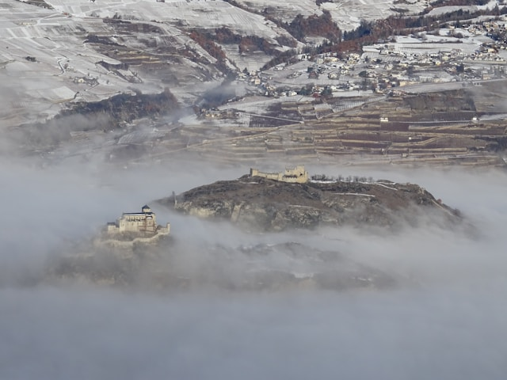

## Landslide risk assessement in an Alpine context
{width=90%}



::: {.callout-note collapse="true"}

## This exercise in brief

### Big Question

Where are the areas most susceptible to new rock instabilities or further destabilization within existing landslide zones,
based on topographic and geological factors?

### What You Will Do

You will combine vector geological maps with raster elevation data to identify areas with high landslide susceptibility.
Using Python libraries developed for handling geospatial data , you will filter specific rock types, calculate slope
gradients from a Digital Elevation Model (DEM), and apply a statistical threshold to pinpoint zones where topography
and lithology create a critical risk of failure.


### Why This Matters

Understanding slope stability is critical for land-use planning and hazard mitigation in Alpine environments. By
analyzing the relationship between lithology, slope angle, and historical instability
ata, we can predict future failures before they occur. This aligns with the Swiss federal approach to hazard mapping,
moving from inventory catalogs to indicative susceptibility maps using reproducible code.


### Your Tasks

1.  **Data Filtering:** Query vector attributes to isolate lithologies prone to instability (Typ_code 800, 801, 802, 870)
and existing instability structures (Typ_code 700, 701).

2.  **Terrain Analysis:** Compute slope gradients from the DEM and calculate statistical metrics (mean) to determine the
stability threshold ($\phi$).

3.  **Susceptibility Modeling:** Apply boolean logic and raster masking to identify:
    3.1. New potential instabilities on favorable lithologies where slope > $\phi$.
    3.2. Critical sub-zones within existing landslides where slope > $\phi$.

4.  **Visualization & Export:** Generate static maps highlighting risk zones with appropriate color ramps and
transparency, and export summary statistics (areas).


### Skills You Will Gain

1. Calculating terrain attributes (slope, hillshade) from DEM arrays.
2. Spatial Querying: Filtering vector data based on attribute expressions.
3. Map Algebra: Performing cell-by-cell mathematical operations and reclassification on raster grids.
4. Cartographic Output: Rendering geospatial data to image formats (PNG/JPG) with custom colormaps.


### Points for Discussion

+ The Threshold Assumption: We assume the mean slope of existing instabilities represents the internal friction angle ($\phi$). How valid is this assumption across different lithological units?
+ Data Resolution: How does the 25m pixel size affect the precision of the slope calculation and the resulting hazard boundaries?
+ Model Limitations: This model relies solely on slope and lithology. How would you integrate dynamic triggers (e.g., precipitation data, seismic history) into this Python workflow?
+ List your results (see list in the Final questions section at the end).
:::

## Step-by-step instructions

### Install libraries

This tutorial requires the following libraries:

+ `rasterio`
+ `geopandas`
+ `matplotlib`
+ `numpy`

You can check if they are installed (and check which version you have) by running:

```{python}
libs = ["rasterio", "geopandas", "matplotlib", "numpy"]

for lib in libs:
    try:
        module = __import__(lib)
        print(lib + " is installed")
    except ImportError:
        print(lib + " is NOT installed")
```

If you encounter an error, come back to [Chapter II: Setting up your Python environment](https://unige-cgeom.github.io/SPACE-GEOLOGY/course/chapter2_setup.html) and follow the instructions.

### Data preparation

#### Lithologies favorable to rock instabilities

We will first prepare our data. The first step is to load the DEM at 25m from the Swiss Federal Office of Topography (swisstopo). The entire dataset is described on the [swisstopo website](https://www.swisstopo.admin.ch/fr/modele-altimetrique-mnt25), but we will use a subset over the region of Sion, Canton of Valais. The DEM is already provided and available in the [data](https://github.com/unige-cgeom/SPACE-GEOLOGY/tree/main/course/data) folder as a GeoTiFF, and we open it using the [rasterio.open](https://rasterio.readthedocs.io/en/latest/api/rasterio.html#rasterio.open) function.

&rarr; With the knowledge you have from the previous exercise, load the GeoTiff file and display its metadata.

&rarr; What is the coordinate reference system of the layer ? What is its resolution ?


```{python}

import rasterio

with rasterio.open("data/DEM/Sion_MNT25.tif") as src:
    dem = src.read(1)
    transform = src.transform
    shape = src.shape
    metadata= src.meta
    crs = src.crs

metadata

```

Second, we will extract the lithologies that favour instabilities the `geopandas` library. This library is an extension of `pandas` specifically designed to handle geospatial data.

You may use `geopandas` to read a *vector* file (for instance shapefile) into a `GeoDataFrame` (gdf), which is simply a `DataFrame`
that contains a geometry column. The example below shows how to simply load bedrock shapefile and print out the *attributes* (i.e., the columns) and the 10 first rows.

```{python}

import geopandas as gpd

bedrock_plg = gpd.read_file(
    r"data/shapefiles/Bedrok_PLG.shp",
    encoding="utf-8"
)
print(bedrock_plg.columns)
bedrock_plg.head(10)

```

To inspect one feature in particular, for instance the first one (index 0), this is very easy to get all properties, or just the geometry:

```{python}
print("First feature:",bedrock_plg.iloc[0])

print("First feature geometry:",bedrock_plg.iloc[0].geometry)
```

We need to filter out the original data to keep only the lithologies of interest. This can be done using the `query` function with the desired condition:

```{python}
select_litho = bedrock_plg.query("Typ_code == '830'")
print(select_litho.iloc[0].Litho)
```
&rarr; What lithology is associated with the code '870' ?

&rarr; How would you do a filtering, not only for 1 value but for 4 different ones ?

```{python}
fav_litho = bedrock_plg.query("Typ_code in ('800', '801', '802', '870')")
print(fav_litho.iloc[0].Litho)
```
Using `matplotlib`, we can plot our favorable lithologies, with a symbology based on the 'Typ_code' attribute:

```{python}
import matplotlib.pyplot as plt

fav_litho.plot(
    figsize=(8, 8),
    column="Typ_code",
    legend=True
)
plt.show()
```

Lithologies will be used as **mask** in the rest of the study. In order to mask out raster data, the lithology layer needs to be converted into a raster that is **aligned** with the raster layer to mask (here, the `Sion_MNT25.tif` layer). Aligned means that the pixels of both layers have the same reference coordinates and extent, providing a 100% overlap. To ensure that, we use the `shape` and `transform` variables obtained from the DEM and pass them to `rasterio`'s [rasterize](https://rasterio.readthedocs.io/en/stable/api/rasterio.features.html#rasterio.features.rasterize) function:

```{python}

from rasterio.features import rasterize

raster_fav_litho = rasterize(
    shapes=((geom, 1) for geom in fav_litho.geometry),
    out_shape=shape,
    transform=transform,
    fill=0,
    dtype="uint8"
)
```

For each polygon in the favorable lithologies, the created pixels will have a value of 1. Other pixels will have a value of 0 (from the 'fill' parameter). Let's visualize the result:

```{python}
plt.imshow(raster_fav_litho)
plt.colorbar()
plt.axis("off")
plt.show()
```

The next step is to export the raster. We ensure that the target directory exists - or, if not, create it - using the [makedirs](https://docs.python.org/3/library/os.html#os.makedirs) function from the `os` library. The `os` library is used to interact with the operating system of your machine, in this case, by creating a folder where

```{python}
import os
os.makedirs(
    "data/outputs",
    exist_ok=True
)

with rasterio.open(
    r"data/outputs/fav_litho.tif", "w",
    driver="GTiff",
    height=shape[0], width=shape[1],
    count=1, dtype="uint8",
    crs=crs, transform=transform
) as dst:
    dst.write(raster_fav_litho, 1)
```

The code writes a `GeoTiFF` file with the same properties (shape, crs, transform) as the original DEM, with one band (defined by the 'count' parameter).

&rarr; Let's go back to our rasterized favorable lithologies. Try calculating the area covered by such lithologies. This
can be done by multiplying the raster pixels width, height and count. The first two are available in the `transform`
property of the raster metadata (originally from the DEM, that we also applied to our rasterized lithologies). The pixel
count can be obtained using `numpy` summing operations.


```{python}
import numpy as np
pixel_width = abs(transform[0])
pixel_height = abs(transform[4])
pixel_area = pixel_width * pixel_height

pixel_count = np.sum(raster_fav_litho == 1)

total_area = pixel_count * pixel_area
print(total_area)
```
&rarr; What does this number represent ? What units ?


#### Existing instabilities

Ler's now inspect and identify existing rock instabilities. Load the 'Instability_Structures_PLG' shapefile and inspect its features in a similar fashion than for the bedrock polygons.

::: {.callout-tip}
## Unique values

You can display all *unique values* in one column using `df['col_name'].unique()`.

:::

```{python}

instabilities_plg = gpd.read_file(
    r"data/shapefiles/Instability_Structures_PLG.shp",
    encoding="utf-8"
)

# Print the columns
print(instabilities_plg.columns)
# Print the first 10 rows
print(instabilities_plg.head(10))

print("First feature:",instabilities_plg.iloc[0])

print("First feature geometry:",instabilities_plg.iloc[0].geometry)

instabilities_plg["TYP_CODE"].unique()
instabilities_plg["TYP_NAME"].unique()
```

&rarr; What are the instabilities you identified?

&rarr; Try plotting the polygons of instabilities with a symbology based on the type

Let's now filter out our existing instabilities using the codes we found in the previous code, and calculate their
combined area.

```{python}
existing_instabilities = instabilities_plg.query("TYP_CODE in ('700', '701')")
existing_instabilities["area_m2"] = existing_instabilities.geometry.area

total_area_plg = existing_instabilities.geometry.area.sum()

print(f"Total area from polygons: {total_area_plg}")
```

Notice how we were able to calculate the area directly on the vector data, unlike what we did with the favorable
lithologies ?

&rarr; Both methods are possible, but which one do you think is best suited ? Why ?

&rarr; Rasterize the existing instabilities and calculate the area on the pixels. What result do you get ?

```{python}
raster_inst = rasterize(
    shapes=((geom, 1) for geom in existing_instabilities.geometry),
    out_shape=shape,
    transform=transform,
    fill=0,
    dtype="uint8"
)

pixel_count = np.sum(raster_inst == 1)

total_area = pixel_count * pixel_area
print(f"Total area from pixels: {total_area}")
```

Let's also export our data to a GeoTiFF using the same command as before.

```{python}
with rasterio.open(
    r"data/outputs/instabilities.tif", "w",
    driver="GTiff",
    height=shape[0], width=shape[1],
    count=1, dtype="uint8",
    crs=crs, transform=transform
) as dst:
    dst.write(raster_inst, 1)
```

#### Slope distribution

We are going to calculate the slope of each pixel from the original DEM to understand the terrain variations and how
these are related to instabilities. In traditional Desktop GIS, there are some tools that already implement slope
calculations, but we can do it manually using `numpy` in Python, se we understand how the slope is calculated.

The slope of a cell is usually calculated using the Horn algorithm (Horn, 1981), and considers the 8 neighbouring cells
elevation (N, S, E, W, NE, NW, SE, SW). With `np.roll`, we can retrieve the information about each neighbouring cell by
just shifting the array, for every cell at once.

```{python}
north = np.roll(dem, -1, axis=0)
south = np.roll(dem,  1, axis=0)
east = np.roll(dem,  1, axis=1)
west = np.roll(dem, -1, axis=1)

north_east = np.roll(north,  1, axis=1)
north_west = np.roll(north, -1, axis=1)
south_east = np.roll(south,  1, axis=1)
south_west = np.roll(south, -1, axis=1)
```

Then, using Horn's formula, we calculate how much elevation changes east-west (dx) and
north-south (dy), that will help us calculate the slope in degrees.

```{python}

dx = ((north_east + 2*east + south_east - north_west - 2*west - south_west)
      / (8 * pixel_width))
dy = ((south_west + 2*south + south_east - north_west - 2*north - north_east)
      / (8 * pixel_height))

slope_deg = np.degrees(np.arctan(np.sqrt(dx**2 + dy**2)))
```
Note that all operations, including `np.roll`, `np.degrees` or `np.arctan` are performed on every pixel of the DEM, this
is what we call vectorized operations. It is built-in to work faster and in a cleaner way than what a loop would do.

Before moving on to analyze our slope values, we need to correct for the issue with slope calculation at the map's edges.
When we do `np.roll`, the pixels of the first and last rows, together with pixels from the first and last column are
moved to the other end of the raster and might induce errors locally. For this reason, we will discard them from our
analysis by assigning them the 'not a number' (NaN) value.

```{python}
slope_deg[0, :]  = np.nan
slope_deg[-1, :] = np.nan
slope_deg[:, 0]  = np.nan
slope_deg[:, -1] = np.nan
```

In the code above, we simply take all pixels from the first row `[0,:]`, all pixels from the last row [-1,:], all pixels
form the first column `[:,0]` and all pixels from the last column `[:,-1]` and set them to NaN using `np.nan`

Let's now have a look at our values and print the minimum, maximum and mean slope.
```{python}
print(f"Min slope:  {np.nanmin(slope_deg)}°")
print(f"Max slope:  {np.nanmax(slope_deg)}°")
print(f"Mean slope: {np.nanmean(slope_deg)}°")
```

&rarr; Plot and save the slope map !

```{python}
left = transform[2]
right = transform[2] + transform[0] * dem.shape[1]
bottom = transform[5] + transform[4] * dem.shape[0]
top = transform[5]

plt.figure(figsize=(8, 8))
plt.imshow(
    slope_deg,
    cmap="magma",
    extent=[left, right, bottom, top]
)
plt.colorbar(label="Slope (degrees)")
plt.show()

with rasterio.open(
    "data/outputs/slope.tif",
    "w",
    driver="GTiff",
    height=shape[0],
    width=shape[1],
    count=1,
    dtype="float32",
    crs=crs,
    transform=transform,
    nodata=np.nan
) as dst:
    dst.write(slope_deg.astype("float32"), 1)
```
&rarr;  Do you understand how we calculated the extent of the map (left, right, bottom, top) ?


::: {.callout-tip}
## Python libraries

The advantage of open-source software is the wealth of available tools developed by and available for the community. The method shown above illustrates how to code an algorithm for slope computation for scratch. However, other libraries specifically designed for DEM handling provide numerous functions for terrain analyses (e.g., [PyDEM](https://github.com/creare-com/pydem)), including slope, aspects, curvature etc...

:::


### Estimate the representative slope angle

Let's now have a look at a specific zone in which we observe instabilities. The area is defined by the polygon
'subequil_PLG_r.shp'. We will load the shapefile and have a look at the slope values inside this very polygon.

To do this, we will use the `geometry_mask` function from `rasterio`. Remember, we used masks in our first exercise by
selecting pixels above sea level, but here we will select all pixels of the slope layer inside the sub-equilibrium
polygon.

```{python}
from rasterio.features import geometry_mask

subequil_zone = gpd.read_file("data/shapefiles/subequil_PLG_r.shp")

mask = geometry_mask(
    subequil_zone.geometry,
    transform=transform,
    invert=True,
    out_shape=shape
)

slope_inside = slope_deg[mask]

print(f"Mean slope inside zone: {np.nanmean(slope_inside):.2f}°")
print(f"Max slope inside zone:  {np.nanmax(slope_inside):.2f}°")
```

&rarr; Plot an histogram that shows the slope distribution within the sampling zone.


```{python}
mean_slope = np.mean(slope_inside)

plt.hist(
    slope_inside,
    bins=50
)
plt.axvline(
    mean_slope,
    color='red',
    linestyle='--',
    label=f'Mean: {mean_slope}°')
plt.xlabel("Slope (°)")
plt.title("Slope distribution inside zone")
plt.legend()
plt.show()
```

### Identify new areas susceptible to instabilities

#### Existing instabilities on favorable lithologies

Now, we will identify areas where we have existing instabilities at locations where the lithology is favorable.

&rarr; Create a new raster (with the same resolution as the original DEM) to identify existing instabilities located on
favorable lithologies.

```{python}
instabilities_on_fav_litho = raster_fav_litho * raster_inst
```

&rarr; Plot the new raster and calculate its area

```{python}
plt.imshow(instabilities_on_fav_litho)
plt.colorbar()
plt.axis("off")
plt.title("Existing instabilities on favorable lithologies")
plt.show()

pixel_count = np.sum(instabilities_on_fav_litho == 1)
print(
    f"Area of existing instabilities on favorable lithologies: "
    f"{pixel_count * pixel_area:.0f} m²"
)
```

#### Zones without instabilities but located on favorable lithologies

&rarr;Using a similar approach, identify the areas where we have favorable lithologies but no observed instabilities.

```{python}
fav_litho_no_instability = (raster_fav_litho == 1) & (raster_inst == 0)

pixel_count = np.sum(fav_litho_no_instability)
print(
    f"Area without instabilities but with favorable lithologies: "
    f"{pixel_count * pixel_area} m²"
)
```

#### Slopes of zone without instabilities but with favorable lithologies

We will now create a subset of our slope map, focusing only on the zones where we have no instabilities and with
favorable lithologies.

```{python}
slope_fav_no_inst = slope_deg[fav_litho_no_instability]
slope_fav_no_inst = slope_fav_no_inst[np.isfinite(slope_fav_no_inst)]
print(f"Min slope: {np.nanmin(slope_fav_no_inst)}°")
print(f"Max slope:  {np.nanmax(slope_fav_no_inst)}°")
```

Given that we have all slope values over our area of interest, we will keep only pixels that have a slope higher than
the $\phi$ value we calculated in the part 2 above. This will give us areas susceptible to instabilities.

&rarr; To do this, reclassify our subset slope raster into two classes, depending on the value of the slope value versus
the $\phi$ value.

```{python}
slope_class = np.where(slope_deg > mean_slope, 1, 0)
susceptible_inst = slope_class * fav_litho_no_instability

pixel_count = np.sum(susceptible_inst == 1)
print(f"Area susceptible to instabilities: {pixel_count * pixel_area:.0f} m²")
```

### Susceptible areas inside the existing instability zones

&rarr; Repeat the slope subset over existing instabilities ('raster_inst') and calculate the area where the slope is greater
than $\phi$.

```{python}
slope_inst = slope_deg[raster_inst]
slope_inst = slope_inst[np.isfinite(slope_inst)]
print(f"Min slope: {np.nanmin(slope_inst)}°")
print(f"Max slope:  {np.nanmax(slope_inst)}°")

slope_class = np.where(slope_deg > mean_slope, 1, 0)
exist_inst_class = slope_class * raster_inst

pixel_count = np.sum(exist_inst_class == 1)
print(f"Area of existing risk: {pixel_count * pixel_area} m²")
```

### Total susceptible areas to rock instabilities

&rarr; Using all of the results you obtained, calculate the total area where we have a susceptibility to instabilities.

```{python}
total_susceptible = susceptible_inst + exist_inst_class
total_susceptible = (total_susceptible >= 1).astype("uint8")

pixel_count = np.sum(total_susceptible == 1)
print(f"Total susceptible area: {pixel_count * pixel_area:.0f} m²")


print(
    f"New potential instabilities (fav. litho, no existing instability): "
    f"{np.sum(susceptible_inst == 1) * pixel_area} m²"
)
print(
    f"Critical zones within existing instabilities:"
    f"{np.sum(exist_inst_class == 1) * pixel_area} m²"
)
```

## Final questions
+ The Threshold Assumption: We assume the mean slope of existing instabilities represents the internal friction angle ($\phi$). How valid is this assumption across different lithological units?
+ Data Resolution: How does the 25m pixel size affect the precision of the slope calculation and the resulting hazard boundaries?
+ Model Limitations: This model relies solely on slope and lithology. How would you integrate dynamic triggers (e.g., precipitation data, seismic history) into this Python workflow?
+ List your results:
    + What proportion (in %) of the area of the favorable lithologies is currently instable ? Provide all the necessary numbers used for the calculation.
    + What proportion (in %) of the zones situated on favorable lithologies could be more likely destabilized in the future? Provide all the necessary numbers used for the calculation.
    + What proportion (in %) of the study area is affected by instabilities ? Provide all the necessary numbers used for the calculation.
    + What proportion (in %) of the area of the existing instabilities is susceptible to new instabilities. Provide all the necessary numbers used for the calculation.
    + What proportion (in %) of the study area is still susceptible to instabilities? Provide all the necessary numbers used for the calculation.


## Links to useful libraries and tools

### Python libraries


- [`geopandas`](https://geopandas.org/) An extension of pandas for working with geospatial vector data, adding geometry support and spatial operations to DataFrames.

- [`os`](https://docs.python.org/3/library/os.html) A Python standard library module for interacting with the operating system, including file and directory management.
