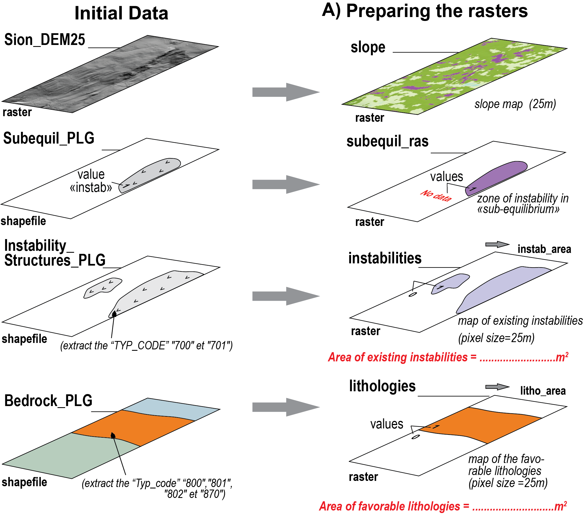
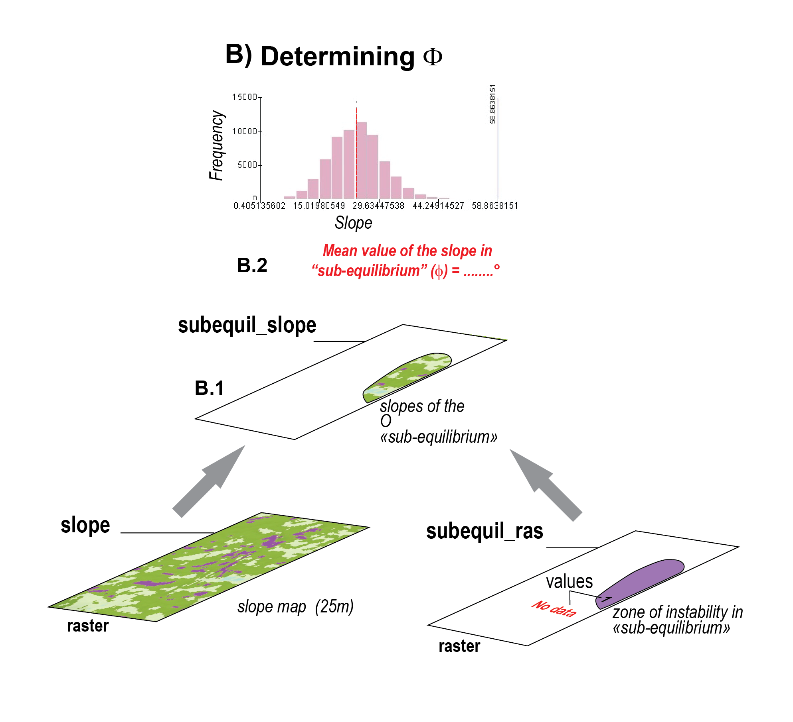
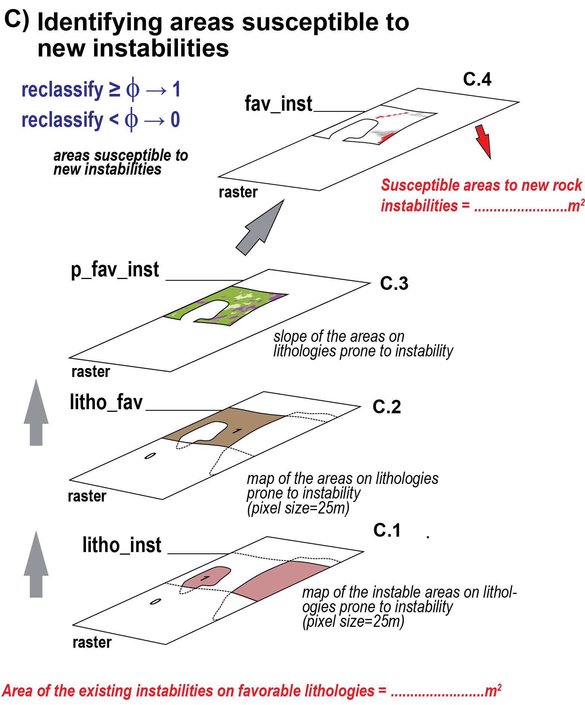
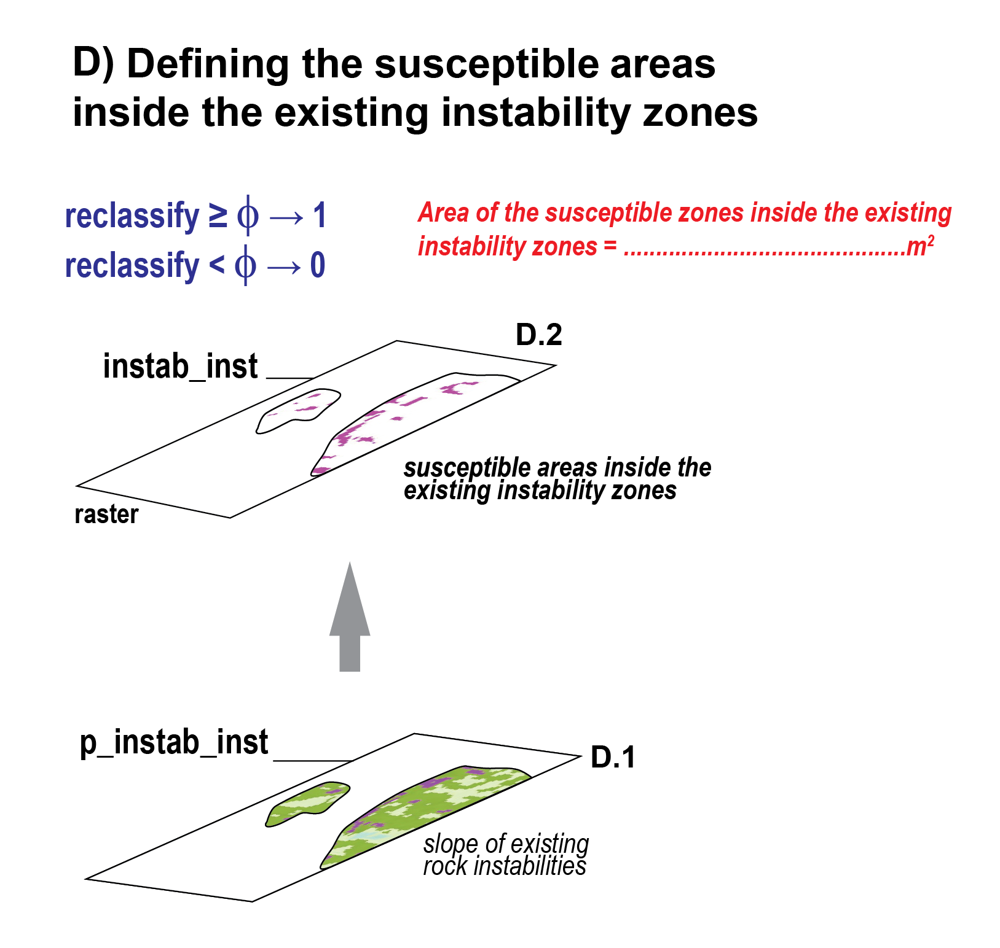

## Landslide risk assessement in an Alpine context
{width=90%}



::: {.callout-note collapse="true"}

## This exercise in brief

### Big Question

Where are the areas most susceptible to new rock instabilities or further destabilization within existing landslide zones, based on topographic and geological factors?

### What You Will Do

You will combine vector geological maps with raster elevation data to identify areas with high landslide susceptibility.
Using Python libraries developed for handling geospatial data , you will filter specific rock types, calculate slope
gradients from a Digital Elevation Model (DEM), and apply a statistical threshold to pinpoint zones where topography
and lithology create a critical risk of failure.


### Why This Matters

Understanding slope stability is critical for land-use planning and hazard mitigation in Alpine environments. By
analyzing the relationship between lithology, slope angle, and historical instability
ata, we can predict future failures before they occur. This aligns with the Swiss federal approach to hazard mapping,
moving from inventory catalogs to indicative susceptibility maps using reproducible code.


### Your Tasks

1.  **Data Filtering:** Query vector attributes to isolate lithologies prone to instability (Typ_code 800, 801, 802, 870)
and existing instability structures (Typ_code 700, 701).

2.  **Terrain Analysis:** Compute slope gradients from the DEM and calculate statistical metrics (mean) to determine the
stability threshold ($\phi$).

3.  **Susceptibility Modeling:** Apply boolean logic and raster masking to identify:
    3.1. New potential instabilities on favorable lithologies where slope > $\phi$.
    3.2. Critical sub-zones within existing landslides where slope > $\phi$.

4.  **Visualization & Export:** Generate static maps highlighting risk zones with appropriate color ramps and
transparency, and export summary statistics (areas).


### Skills You Will Gain

1. Calculating terrain attributes (slope, hillshade) from DEM arrays.
2. Spatial Querying: Filtering vector data based on attribute expressions.
3. Map Algebra: Performing cell-by-cell mathematical operations and reclassification on raster grids.
4. Cartographic Output: Rendering geospatial data to image formats (PNG/JPG) with custom colormaps.


### Points for Discussion

+ The Threshold Assumption: We assume the mean slope of existing instabilities represents the internal friction angle ($\phi$). How valid is this assumption across different lithological units?
+ Data Resolution: How does the 25m pixel size affect the precision of the slope calculation and the resulting hazard boundaries?
+ Model Limitations: This model relies solely on slope and lithology. How would you integrate dynamic triggers (e.g., precipitation data, seismic history) into this Python workflow?
+ List your results (see list in the Final questions section at the end).
:::

## Step-by-step instructions

### Install libraries

This tutorial requires the following libraries:

+ `rasterio`
+ `geopandas`
+ `matplotlib`
+ `numpy`

You can check if they are installed (and check which version you have) by running:

```{python}
libs = ["rasterio", "geopandas", "matplotlib", "numpy"]

for lib in libs:
    try:
        module = __import__(lib)
        print(lib + " is installed")
    except ImportError:
        print(lib + " is NOT installed")
```

If you encounter an error, come back to [Chapter II: Setting up your Python environment](https://unige-cgeom.github.io/SPACE-GEOLOGY/course/chapter2_setup.html) and follow the instructions.

Let's already load all the libraries we need:

```{python}
#| echo: true
import geopandas as gpd
import rasterio
from rasterio.features import rasterize, geometry_mask
import numpy as np
import matplotlib.pyplot as plt
```

```{python}
#| echo: false

# import pathlib
# source_dir = pathlib.Path("/Users/seb/Documents/WORK/Teaching/UNIGE/Certificates/Space geol/SPACE-GEOLOGY/course/data")
# output_dir = pathlib.Path("/Users/seb/Documents/WORK/Teaching/UNIGE/Certificates/Space geol/SPACE-GEOLOGY/course/output")


```


### Step A: Data preparation

You are provided with the following input data:

| Name | Format | Description |
| ---- | ---- | --------- |
| `Sion_MNT25.tif` | Raster | DEM of the Sion area (© Swisstopo) at a spatial resolution of 25 m |
| `Bedrok_PLG.shp` | Shapefile | Bedrock geology |
| `Instability_Structures_PLG.shp` | Shapefile | Mapped instabilities |
| `Subequil_PLG_r.shp` | Shapefile | Area representing a state of sub-equilibrium. This area has been defined in the field and represents the ground truth. |

{#fig-stepA width=70% fig-align="left" .img-up-0 .lightbox }


#### Digital elevation model

We will first prepare our data. The first step is to load the DEM at 25m from the Swiss Federal Office of Topography (swisstopo). The entire dataset is described on the [swisstopo website](https://www.swisstopo.admin.ch/fr/modele-altimetrique-mnt25), but we will use a subset over the region of Sion, Canton of Valais. The DEM is already provided and available in the [data](https://github.com/unige-cgeom/SPACE-GEOLOGY/tree/main/course/data) folder as a GeoTiFF, and we open it using the [`rasterio.open`](https://rasterio.readthedocs.io/en/latest/api/rasterio.html#rasterio.open) function.

::: {.callout-note}
## Question

Load the geotiff using `rasterio.open` as in the following block and save the following attributes as variables: 

- `profile`
- `shape`
- `bounds`
- `crs`
- `transform`

Inspect all variables

- What variables are in **matrix coordinates?** What variables are in geographic coordinates?
- What is the coordinate reference system of the layer ? What is its resolution ?

:::


```{python}
#| lst-label: lst-load_raster
#| lst-cap: Load raster with rasterio.

with rasterio.open("data/DEM/Sion_MNT25.tif") as src:
# with rasterio.open(source_dir / "DEM" / "Sion_MNT25.tif") as src:
    dem = src.read(1) # The data
    profile = src.profile # Raster metadata (contains all the variables below)
    shape = src.shape
    bounds = src.bounds
    crs = src.crs
    transform = src.transform # Affine transformation

```

#### Lithologies favorable to rock instabilities

Second, we will extract the lithologies that favour instabilities the `geopandas` library. This library is an extension of `pandas` specifically designed to handle geospatial data.

You may use `geopandas` to read a *vector* file (for instance shapefile) into a `GeoDataFrame`  (gdf), which is simply a `DataFrame` that contains a geometry column. The example below shows how to load the `Bedrok_PLG.shp` shapefile with [`gpd.read_file`](https://geopandas.org/en/v1.1.0/docs/reference/api/geopandas.read_file.html) and perform basic operations. Really, a `gpd` object represents the **table of attributes** you might be familiar with in QGis.

::: {.callout-tip}
## Encoding
Specifying the `encoding` argument to `utf-8` is critical to preserve French accents in the attributes.
:::


```{python}
#| lst-label: lst-read-shp
#| lst-cap: Read a shapefile with geopandas

bedrock_plg = gpd.read_file( r"data/shapefiles/Bedrok_PLG.shp", encoding="utf-8")
# bedrock_plg = gpd.read_file(source_dir / "shapefiles" / "Bedrok_PLG.shp", encoding="utf-8")

```


Spend some time exploring your shapefile with the following functions:

```{python}
#| eval: false
#| 
# Print the first 5 columns
bedrock_plg.head(5)
```

```{python}
#| eval: false

# Print the column names
bedrock_plg.columns
```

```{python}
#| eval: false

# Query the first row/feature - remember, in Python the first row/column is represented by the index 0 (not 1)
bedrock_plg.iloc[0]
```

```{python}
#| eval: false

# Query a specific column
bedrock_plg['Typ_code']
```

##### Data filtering

We need to filter out the original data to keep only the lithologies of interest. This can be done using the [`pd.query()`](https://pandas.pydata.org/docs/reference/api/pandas.DataFrame.query.html) function with the desired condition:

```{python}
select_litho = bedrock_plg.query("Typ_code == '830'")
select_litho.iloc[0].Litho
```

::: {.callout-tip}
## Pandas vs geopandas
As you might notice, geopandas objects inherit from most pandas functions, such as `query()`.
:::

::: {.callout-note}
## Questions

- What lithology is associated with the code '870'?
- How would you filter for multiple values?

:::


::: {.callout-warning}
## Solution
:::

```{python}
#| eval: true
#| code-fold: true
#| output: false
#| lst-label: lst-query
#| lst-cap: Filtering a shapefile using query

lithologies = bedrock_plg.query("Typ_code in ('800', '801', '802', '870')")
lithologies.iloc[0]['Litho']
```

In the end we have:

```{python}
#| echo: false

lithologies[['Typ_code', 'Litho']].drop_duplicates()
```


##### Plotting shapefiles

We can easily plot the favorable lithologies, colouring each polygon according to its 'Typ_code' attribute:


```{python}
#| lst-label: lst-plot_poly
#| lst-cap: Plotting polygons using gpd. The column argument specifies which column to use as a distinctive value for the colourmap.

lithologies.plot( figsize=(8, 8), column="Typ_code", legend=True)

```

##### Converting shapefiles to raster

Lithologies will be used as **mask** in the rest of the study. In order to mask out raster data, the lithology layer needs to be converted into a raster that is **aligned** with the raster layer to mask (here, the `Sion_MNT25.tif` layer). Aligned means that the pixels of both layers have the same reference coordinates and extent, providing a 100% overlap. To ensure that, we use the `shape` and `transform` variables obtained from the DEM and pass them to `rasterio`'s [rasterize](https://rasterio.readthedocs.io/en/stable/api/rasterio.features.html#rasterio.features.rasterize) function:

```{python}
#| lst-label: lst-rasterize
#| lst-cap: Function to rasterize a shapefile

lithologiesR = rasterize(
    shapes=((geom, 1) for geom in lithologies.geometry),
    out_shape=shape,
    transform=transform,
    fill=0,
    dtype="uint8"
)
```

For each polygon in the favorable lithologies, the created pixels will have a value of 1. Other pixels will have a value of 0 (from the 'fill' parameter). Let's visualize the result:

```{python}
#| lst-label: lst-plot_raster
#| lst-cap: Plotting a raster using matplotlib.

import matplotlib.pyplot as plt

plt.imshow(lithologiesR)

```

##### Exporting a raster

The next step is to export the raster. 

1. We ensure that the target directory exists - or, if not, create it - using the [makedirs](https://docs.python.org/3/library/os.html#os.makedirs) function from the `os` library.
2. We write the raster with - counter-intuitively - the `rasterio.open` function (→ we prepare the file inside which the data will be written) followed by the `.write()` function (→ that actually writes the data).

::: {.callout-important}
## Using `profile` for alignement

The objective here is to create a raster with the exact **extent** and **resolution** as the reference raster - here the `dem` variable. To ensure **alignement**, we pass the `profile` variable that we extracted from the Sion DEM to the function, which contains all required information (e.g., bounds, resolution, crs, affine transform etc.).

::: 

```{python}
#| lst-label: lst-save_raster
#| lst-cap: Saving a raster and ensuring alignment.

import os
os.makedirs(
    "data/outputs",
    exist_ok=True
)

with rasterio.open(
    "data/outputs/lithologiesR.tif", "w",
    **profile
) as dst:
    dst.write(lithologiesR, 1)

```

The code writes a `GeoTiFF` file with the same properties (shape, crs, transform) as the original DEM, with one band (defined by the 'count' parameter).

##### Calculating areas


The first assignment is to calculate **the area covered by lithologies favourable to instabilities**. This can essentially be done from both the shapefile and the raster.

Using the **shapefile**, you need to add a new column and use the [`.area`](https://geopandas.org/en/stable/docs/reference/api/geopandas.GeoSeries.area.html) function followed by the [`.sum()`](https://pandas.pydata.org/docs/reference/api/pandas.DataFrame.sum.html) function.

::: {.callout-warning}
## Solution
:::

```{python}
#| eval: true
#| code-fold: true
#| output: false
#| lst-label: lst-poly_area
#| lst-cap: Computing area from polygons.

litho_area = lithologies.area.sum()

print(f"The area of favourable lithologies computed from polygons is: {litho_area:.2f} m²")

```


Using the **raster**, we first need to get the area of a pixel based on their width and height which are respectively the first and third elements of the `transform` variable. We can then sum the pixels (remember, all favourable lithologies have a value of 1, the other a value of 0) and multiply the result by the pixel area. We do that with `numpy`.

::: {.callout-warning collapse="true"}
## Computing pixel area

```{python}
#| echo: true
#| lst-label: lst-pixel_area
#| lst-cap: Computing pixel area from width/height.

pixel_width = abs(transform[0]) # Pixel width
pixel_height = abs(transform[4]) # Pixel height
pixel_area = pixel_width * pixel_height
```

:::


Now compute the area of instabilities.

::: {.callout-warning}
## Solution
:::

```{python}
#| eval: true
#| code-fold: true
#| output: false
#| lst-label: lst-raster_area
#| lst-cap: Computing area from a raster


pixel_count = np.sum(lithologiesR == 1)
total_area = pixel_count * pixel_area
```


::: {.callout-note}
## Question

- What is the area of favourable lithologies computed from the raster?
- How much difference is there with the polygon approach? Why?

:::


#### Existing instabilities

Let's now inspect and identify existing rock instabilities. Load the `Instability_Structures_PLG` shapefile following @lst-read-shp and inspect its features as we did for the bedrock polygons.

::: {.callout-tip}
## Unique values

You can display all *unique values* in one column using `df['col_name'].unique()`.

:::

```{python}
#| echo: false
instabilities_plg = gpd.read_file(r"data/shapefiles/Instability_Structures_PLG.shp",encoding="utf-8")
# instabilities_plg = gpd.read_file(source_dir / "shapefiles" / "Instability_Structures_PLG.shp", encoding="utf-8")

```


```{python}
#| echo: false
#| lst-label: lst-instab_raster
#| lst-cap: Rasterization of the instabilities

instabilities = instabilities_plg.query("TYP_CODE in ('700', '701')")

# Rasterize
instabilitiesR = rasterize(
    shapes=((geom, 1) for geom in instabilities.geometry),
    out_shape=shape,
    transform=transform,
    fill=0,
    dtype="uint8"
)


```


::: {.callout-note}
## Questions
- What instabilities do you identify?
- Plot the polygons of instabilities with a symbology based on the type following @lst-plot_poly
- Filter the shapefile following @lst-query. We want to retrieve the values `'700'` and `'701'` from the `TYP_CODE` column. Save the result into a new variable called `instabilities`.
- Rasterize `instabilities` into a raster named `instabilitiesR` following @lst-rasterize.
- Estimate the area of existing instabilities following @lst-poly_area.
- Export `instabilitiesR` to "data/outputs/instabilitiesR.tif" following @lst-save_raster.
:::


#### Slope calculation

The next step is to calculate the slope from the DEM. Most desktop GIS software implement slope calculation - so do a lot of Python packages (e.g., [PyDEM](https://github.com/creare-com/pydem)). Below is an illustration of how slope is calculated from scratch using `numpy`. If you have time, go through the code and ask any question you might have. If you don't, you can just use the `slope` variable.

::: {.callout-tip collapse="true"}
## Slope calculation

The slope of a cell is usually calculated using the Horn algorithm (Horn, 1981), and considers the 8 neighbouring cells
elevation (N, S, E, W, NE, NW, SE, SW). With `np.roll`, we can retrieve the information about each neighbouring cell by
just shifting the array, for every cell at once.

```{python}
north = np.roll(dem, -1, axis=0)
south = np.roll(dem,  1, axis=0)
east = np.roll(dem,  1, axis=1)
west = np.roll(dem, -1, axis=1)

north_east = np.roll(north,  1, axis=1)
north_west = np.roll(north, -1, axis=1)
south_east = np.roll(south,  1, axis=1)
south_west = np.roll(south, -1, axis=1)
```

Then, using Horn's formula, we calculate how much elevation changes east-west (dx) and
north-south (dy), that will help us calculate the slope in degrees.

```{python}

dx = ((north_east + 2*east + south_east - north_west - 2*west - south_west)
      / (8 * pixel_width))
dy = ((south_west + 2*south + south_east - north_west - 2*north - north_east)
      / (8 * pixel_height))

slope = np.degrees(np.arctan(np.sqrt(dx**2 + dy**2)))
```
Note that all operations, including `np.roll`, `np.degrees` or `np.arctan` are performed on every pixel of the DEM, this
is what we call vectorized operations. It is built-in to work faster and in a cleaner way than what a loop would do.

Before moving on to analyze our slope values, we need to correct for the issue with slope calculation at the map's edges.
When we do `np.roll`, the pixels of the first and last rows, together with pixels from the first and last column are
moved to the other end of the raster and might induce errors locally. For this reason, we will discard them from our
analysis by assigning them the 'not a number' (NaN) value.

```{python}
slope[0, :]  = np.nan
slope[-1, :] = np.nan
slope[:, 0]  = np.nan
slope[:, -1] = np.nan
```

In the code above, we simply take all pixels from the first row `[0,:]`, all pixels from the last row [-1,:], all pixels
form the first column `[:,0]` and all pixels from the last column `[:,-1]` and set them to NaN using `np.nan`


:::


Now - **very importantly** - the `slope` raster is a `numpy` object, which means it *is* a raster, but depleted of any spatial reference. This implies two things.

Firstly, **to plot the data** with coordinate extents, we need to specify the `extent` argument of [`plt.imshow`](https://matplotlib.org/stable/api/_as_gen/matplotlib.pyplot.imshow.html). For this, use the `bounds` variable we got from @lst-load_raster.

::: {.callout-note}
## Question

- Try plotting using
  - `plt.imshow(slope)`
  - `plt.imshow(slope, extent=bounds)`
- What difference do you see?

:::

::: {.callout-warning}
## Full map
```{python}
#| echo: true

plt.figure(figsize=(8, 8))
plt.imshow(
    slope,
    cmap="magma",
    extent=bounds
)
plt.colorbar(label="Slope (degrees)")
plt.show()

```
:::

Secondly, **to save the data**, we need to specify some more parameters compared to @lst-save_raster. Specifically, we want to update the `profile` variable we got at @lst-load_raster to i) make sure we store the data as `float 32` (→ a format that allows storing loads of decimals) and ii) we set the no data value to be a `nan` (→ a *not a number* format, equivalent to a transparent colour on QGIS).

```{python}
#| echo: true

profile.update(dtype="float32", nodata=np.nan)

with rasterio.open("data/outputs/slope.tif", "w", **profile) as dst:
    dst.write(slope.astype("float32"), 1)
```

#### Ground truth

```{python}
#| echo: false

subequil_PLG = gpd.read_file("data/shapefiles/subequil_PLG_r.shp")
# subequil_PLG = gpd.read_file(source_dir / "shapefiles" / "subequil_PLG_r.shp")
```


The file `subequil_PLG_r.shp` contains an area where instabilities have been observed in the field. Load it into a variable called `subequil_PLG` following @lst-read-shp.

We will use this area to extract the slope from `slope`, so we need to *rasterize* it, but in a special format that can be used as a **mask**, which is done using the [`geometry_mask`](https://rasterio.readthedocs.io/en/latest/api/rasterio.features.html#rasterio.features.geometry_mask) function.


```{python}
#| echo: true
#| lst-label: lst-mask
#| lst-cap: Rasterize shapefile into a boolean mask.

subequilR = geometry_mask(
    subequil_PLG.geometry,
    transform=transform,
    invert=True,
    out_shape=shape
)
```

::: {.callout-tip collapse="true"}
## Difference between `rasterize` and `geometry_mask`

So what is the difference between the [`rasterize`](https://rasterio.readthedocs.io/en/latest/api/rasterio.features.html#rasterio.features.rasterize) function used in @lst-rasterize and the [`geometry_mask`](https://rasterio.readthedocs.io/en/latest/api/rasterio.features.html#rasterio.features.geometry_mask) function used in @lst-mask? The short answer is **the type of data** returned by the function.

[`Rasterize`](https://rasterio.readthedocs.io/en/latest/api/rasterio.features.html#rasterio.features.rasterize) returns an **integer** type (e.g., 0, 1, 2, 3):

```{python}
#| echo: true
lithologiesR.dtype
```

[`Geometry_mask`](https://rasterio.readthedocs.io/en/latest/api/rasterio.features.html#rasterio.features.geometry_mask) returns a **boolean** type (e.g., True/False). This is the format commonly used to **mask data**:

```{python}
#| echo: true
subequilR.dtype
```
:::


### Step B: Determining the angle of repose $\Phi$

{#fig-stepB width=70% fig-align="left" .img-up-0 .lightbox }

::: {.callout-important}
## Things we want to compute in Step B

1. Mean value of the slope in "sub-equilibrium"

:::

#### B1. Extract the slope contained witin the mask

We need to extract the slope contained within the mask we just created. Save it into a new variable called `subequil_slope`. Any idea how to do this using **boolean indexing**?

::: {.callout-warning collapse="true"}
## Answer
```{python}
#| echo: true
subequil_slope = slope[subequilR]
```
:::

#### B2. Estimate the angle of repose $\Phi$

We can plot a distribution of observed slope values within this zone using [`plt.hist`](https://matplotlib.org/stable/api/_as_gen/matplotlib.pyplot.hist.html). The mean value of this plot is the **mean value of the slope in "sub-equilibrium"**, which corresponds to the threshold above which instabilities can be reactivated.

```{python}
#| echo: true
#| lst-label: lst-hist
#| lst-cap: Histogram of slopes within the area of interest.

fig, ax = plt.subplots(figsize=(6, 3.5))
ax.hist(subequil_slope, bins=50)
ax.axvline(np.nanmean(subequil_slope), color="red", linestyle="--")
ax.set_xlabel("Slope (degrees)")
ax.set_title("Slope distribution in the sub-equilibrium zone");

```

::: {.callout-note}
## Question

- Compute the **mean slope** of `subequil_slope` using the [`np.nanmean()`](https://numpy.org/devdocs/reference/generated/numpy.nanmean.html) function.
- Save it under a new variable called `phi_angle`.

:::

```{python}
#| echo: false
phi_angle = np.nanmean(subequil_slope)
```


### Step C: Estimating area susceptible to new instabilities

{#fig-stepC width=70% fig-align="left" .img-up-0 .lightbox }

::: {.callout-important}
## Things we want to compute in Step C

1. Area of the existing instabilities on favorable lithologies
2. Susceptible areas to new rock instabilities

:::

#### C1. Estimate the area of existing instabilities on favourable lithologies

The next step identify areas where we have existing instabilities at locations where the lithology is favorable. For this, you need `instabilitiesR` (@lst-instab_raster) and `lithologiesR` (@lst-rasterize). Save it in a new variable name called `litho_inst`.

For this, we need to introduce **logical operators**. For instance:

- `lithologiesR == 1` returns a **boolean** raster (same as in @lst-mask) where values of 1 are not set to `True` and values of 0 to `False`.
- Same for `instabilitiesR`.

Now, which **logical** operator would you use to identify the pixels where both rasters are `True`?


::: {.callout-warning collapse="true"}
## Solution

The operator *AND* (in Python `&`). Don't forget to wrap each side of the operator in parentheses.

```{python}

litho_inst = (lithologiesR==1) & (instabilitiesR==1)
```

:::

::: {.callout-note}
## Questions

1. Plot the raster
2. Calculate the area of existing instabilities on favourable lithologies (see @lst-raster_area)
:::


#### C2. Estimate the area of zones on favourable lithologies outside instabilities

The next step is to estimate the area of zones on favourable lithologies **outside instabilities**. 

```{python}
#| lst-label: lst-fl_ni
#| lst-cap: Zones on favourable lithologies outside instabilities.

litho_fav = (lithologiesR == 1) & (instabilitiesR == 0)
```

::: {.callout-note}
## Questions

1. Plot the raster
2. Calculate the area of existing instabilities on favourable lithologies outside instabilities (see @lst-raster_area)
:::


#### C3. Estimate the slope of zones on favourable lithologies outside instabilities

We will now create a subset of the slope map for the pixels identified in `litho_fav` (@st-fl_ni). The slope might contains some **no data** values (→ `np.nan`), which we filter out using `np.isfinite`.

```{python}
slope_p_fav_inst = slope[litho_fav]
slope_p_fav_inst = slope_p_fav_inst[np.isfinite(slope_p_fav_inst)]
```

#### C4. Reclassify the slope

The next step is to identify is to identify the pixels in `slope_p_fav_inst` that have a slope ≥ $\Phi$ (i.e., `phi_angle`). For this, we use the function [`np.where()`](https://numpy.org/doc/2.4/reference/generated/numpy.where.html). And since the doc for this function is the perfect example of how incomprehensible instructions might be for non experts, we provide you with the solution.

```{python}
slope_class = np.where(slope > phi_angle, 1, 0)
```

We can now identify the pixels in favourable lithologies that are prone to new instabilities.

```{python}
p_fav_inst = (slope_class==1) & (litho_fav==1)
```

::: {.callout-note}
## Questions

1. Plot the raster
2. Calculate the area of pixels in favourable lithologies that are prone to new instabilities (see @lst-raster_area)
:::


### Step D: Susceptible zones inside existing instabilities

{#fig-stepD width=70% fig-align="left" .img-up-0 .lightbox }

Repeat the same as step C4 but considering zones **inside** existing instabilities (→ `instabilitiesR`). Save it in a variable name called `fav_inst`.

::: {.callout-note}
## ## Questions

1. Plot the raster
2. Calculate the area of susceptible zones inside existing instabilities (see @lst-raster_area)

:::


### Total susceptible areas to rock instabilities

Calculate the total area where we have a susceptibility to instabilities (→ `p_fav_inst + fav_inst`)


## Final questions

+ **The Threshold Assumption**: We assume the mean slope of existing instabilities represents the internal friction angle ($\phi$). How valid is this assumption across different lithological units?
+ **Data Resolution**: How does the 25m pixel size affect the precision of the slope calculation and the resulting hazard boundaries?
+ **Model Limitations**: This model relies solely on slope and lithology. How would you integrate dynamic triggers (e.g., precipitation data, seismic history) into this Python workflow?

## Results

List your results. Provide all the necessary numbers used for the calculation. Make sure you round the digits to a reasonable number of decimals.

- What proportion (in %) of the area of the favorable lithologies is currently instable ? 
- What proportion (in %) of the zones situated on favorable lithologies could be more likely destabilized in the future? 
- What proportion (in %) of the study area is affected by instabilities ? 
- What proportion (in %) of the area of the existing instabilities is susceptible to new instabilities. 
- What proportion (in %) of the study area is still susceptible to instabilities? 


## Links to useful libraries and tools

### Python libraries


- [`geopandas`](https://geopandas.org/): An extension of pandas for working with geospatial vector data, adding geometry support and spatial operations to DataFrames.
- [contextily](https://contextily.readthedocs.io/en/latest/): A useful package to retrive tiles from basemap and plot them behind your `mpl` maps.
- [cartopy](https://cartopy.readthedocs.io/stable/): If you want to elevate your Python plotting skills, `cartopy` is probably the way to go.
- [pyGMT](https://www.pygmt.org/latest/): Similar to `cartopy`.
- [Palettable](https://jiffyclub.github.io/palettable/#) Library of color palettes for Python include most of those listed below.

### Colour maps

- [cartocolors](https://carto.com/carto-colors/): Custom color schemes built on top of well-known standards for color use on maps
- [crameri colour maps](https://www.fabiocrameri.ch/colourmaps/): Accurate data visualisation scales readable by everyone.